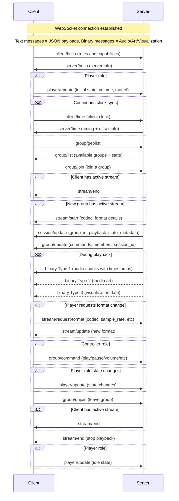

# The Resonate Protocol

_This is raw, unfiltered and experimental._

Resonate is a multi-room music experience protocol. The goal of the protocol is to orchestrate all devices that make up the music listening experience. This includes outputting audio on multiple speakers simultaneously, screens and lights visualizing the audio or album art, and wall tablets providing media controls.

## Definitions

- **Resonate Server** - orchestrates all devices, generates audio streams, manages players and clients, provides metadata
- **Resonate Client** - a client that can play audio, visualize audio, display metadata, or provide music controls. Has different possible roles (player, metadata, controller, visualizer). Every client has a unique identifier
  - **Player** - receives audio and plays it in sync. Has its own volume and mute state and preferred format settings
  - **Metadata** - displays metadata. Has preferred format for cover art
  - **Controller** - controls Resonate groups
  - **Visualizer** - visualizes music. Has preferred format for audio features
- **Resonate Group** - a group of clients. Each client belongs to exactly one group, and every group has at least one client. Every group has a unique identifier. Each group has the following states: list of member clients, volume, mute, and active session (may be null)
- **Resonate Session** - details the currently playing media and its playback state. Has associated metadata and a unique identifier. Each session is associated with exactly one group
- **Resonate Stream** - client-specific details on how the server is formatting and sending binary data. Each client receives its own independently encoded stream based on its capabilities and preferences. The server sends audio chunks as far ahead as the client's buffer capacity allows

## Establishing a Connection

Clients announce their presence via mDNS using the service type `_resonate._tcp`.

Resonate communicates over WebSockets on the path `/resonate`. Recommended port is `8927`.

Resonate servers support connections from browsers, mobile apps, and other WebSocket-capable clients.

## Communication

Once the connection is established, Client and Server are going to talk.

WebSocket text messages are used to send JSON payloads.

**Note:** In field definitions, `?` indicates an optional field (e.g., `field?`: type means the field may be omitted).

Message format:

```json
{
  "type": "stream/start",
  "payload": { ... }
}
```

WebSocket binary messages are used to send audio chunks, media art, and visualization data. The first byte is a uint8 representing the message type.

## Clock Synchronization

Clients continuously send `client/time` messages to maintain an accurate offset from the server's clock. The frequency of these messages is determined by the client based on network conditions and clock stability.

Binary audio messages contain timestamps in the server's time domain indicating when the audio should be played. Clients use their computed offset to translate server timestamps to their local clock for synchronized playback.

## Playback Synchronization

- Each client is responsible for maintaining synchronization with the server's timestamps
- Clients maintain accurate sync by adding or removing samples using interpolation to compensate for clock drift
- When a client cannot maintain sync (e.g., buffer underrun), it should mute its audio output and continue buffering until it can resume synchronized playback
- The server is unaware of individual client sync synchronized accuracy - it simply broadcasts timestamped audio
- Late-joining clients receive audio with future timestamps only, allowing them to start playback in sync with existing clients



## Client → Server: `client/hello`

Information about the Resonate client.
Players that can output audio should have the role `player`.

- `client_id`: string - uniquely identifies the client for groups and de-duplication
- `name`: string - friendly name of the client
- `version`: number - version that the Resonate client implements
- `supported_roles`: string[] - at least one of:
  - `player` - outputs audio
  - `controller` - controls a group
  - `metadata` - displays metadata
  - `visualizer` - visualizes audio
- `player_support?`: object - only if `player` role is set
  - `support_codecs`: string[] - supported codecs in priority order
  - `support_channels`: number[] - number of channels in priority order
  - `support_sample_rates`: number[] - supported sample rates in priority order
  - `support_bit_depth`: number[] - bit depth in priority order
  - `buffer_capacity`: number - buffer capacity size in bytes
- `metadata_support?`: object - only if `metadata` role is set
  - `support_picture_formats`: string[] - supported media art image formats (empty array if no art desired)
  - `media_width?`: number - max width in pixels (if only width set, scales preserving aspect ratio)
  - `media_height?`: number - max height in pixels (if only height set, scales preserving aspect ratio) 
- `visualizer_support?`: object - only if `visualizer` role is set
  - Desired FFT details (to be determined)
  - `buffer_capacity`: number - buffer capacity size in bytes


<!-- * `support_streams` string\[\] Supported streams (can be media, or voice (not supported now)). -->


## Server → Client: `server/hello`

Information about the server.

- `server_id`: string - identifier of the server
- `name`: string - friendly name of the server
- `version`: number - latest supported version of Resonate

## Client → Server: `client/time`

Sends current internal clock timestamp (in microseconds) to server.

- `client_transmitted`: number - client's internal clock timestamp in microseconds

## Server → Client: `server/time`

Response to the client's time message with info to establish clock offsets.

- `client_transmitted`: number - client's internal clock timestamp received in the `client/time` message
- `server_received`: number - timestamp that the server received the client/time message in microseconds
- `server_transmitted`: number - timestamp that the server transmitted this message in microseconds

## Server → Client: `stream/start`

When a new stream starts.

- `player?`: object - only sent to clients with the `player` role
  - `codec`: string - codec to be used
  - `sample_rate`: number - sample rate to be used
  - `channels`: number - channels to be used
  - `bit_depth`: number - bit depth to be used
  - `codec_header?`: string - Base64 encoded codec header (if necessary; e.g., FLAC)
- `visualizer?`: object - only sent to clients with the `visualizer` role
  - FFT details (to be determined)
- `metadata?`: object - only sent to clients with the `metadata` role that specified supported picture formats
  - `art_format`: 'bmp' | 'jpeg' | 'png' - format of the encoded image

## Server → Client: `stream/update`

When the format of the messages changes for the ongoing stream. Deltas updating only the relevant fields.

- `player?`: object - only sent to clients with the `player` role
  - `codec`: string - codec to be used
  - `sample_rate`: number - sample rate to be used
  - `channels`: number - channels to be used
  - `bit_depth`: number - bit depth to be used
  - `codec_header?`: string - Base64 encoded codec header (if necessary; e.g., FLAC)
- `visualizer?`: object - only sent to clients with the `visualizer` role
  - FFT details (to be determined)
- `metadata?`: object - only sent to clients with the `metadata` role that specified supported picture formats
  - `art_format`: 'bmp' | 'jpeg' | 'png' - format of the encoded image

## Server → Client: `stream/end`

Player should stop streaming and clear buffers - report idle state.
Visualizer should stop visualizing and clear buffers.

No payload.

## Server → Client: `session/update`

Delta updates that must be merged into existing state. Fields set to `null` should be nullified. The server should null the metadata whenever a session is ended.

- `group_id`: string - group identifier
- `playback_state?`: 'playing' | 'paused' | 'stopped' - only sent to clients with `controller` or `metadata` roles
- `metadata?`: object - only sent to clients with `metadata` role
  - `timestamp`: number - server timestamp for when this metadata is valid
  - `title?`: string | null
  - `artist?`: string | null
  - `album_artist?`: string | null
  - `album?`: string | null
  - `artwork_url?`: string | null
  - `year?`: number | null
  - `track?`: number | null
  - `track_progress?`: number | null - in seconds
  - `track_duration?`: number | null - in seconds
  - `playback_speed?`: number | null - speed factor
  - `repeat?`: 'off' | 'one' | 'all' | null
  - `shuffle?`: boolean | null

## Server → Client: `group/update`

Group state update.

- `supported_commands`: string[] - subset of: `play`, `pause`, `stop`, `next`, `previous`, `seek`, `volume`, `mute`
- `members`: object[] - list of group members
  - `client_id`: string - client identifier
  - `name`: string - client friendly name
- `session_id`: string | null - null if no active session

## Client → Server: `group/command`

Control the group that's playing. Only valid from clients with the `controller` role.

- `command`: 'play' | 'pause' | 'stop' | 'next' | 'previous' | 'seek' | 'volume' | 'mute' - must be one of the values listed in `group/update` field `supported_commands`
- `volume?`: number - volume range 0-100, only set if `command` is `volume`
- `mute?`: boolean - true to mute, false to unmute, only set if `command` is `mute`

## Client → Server: `player/update`

Informs the server of player state changes. Only for clients with the `player` role.

Must be sent immediately after receiving `server/hello` and whenever any state changes.

- `state`: 'playing' | 'idle' - playing if active stream, idle if no active stream
- `volume`: number - range 0-100
- `muted`: boolean - mute state

## Client → Server: `group/get-list`

Request all groups available to join on the server.

No payload.

## Server → Client: `group/list`

All groups available to join on the server.

- `groups`: object[] - list of available groups
  - `group_id`: string - group identifier
  - `name`: string - group name
  - `state`: 'playing' | 'paused' | 'idle'
  - `member_count`: number - number of clients in group

## Client → Server: `group/join`

Join a group.

- `group_id`: string - identifier of group to join

Response: `stream/end` (if client has active stream) followed by `stream/start` (if new group has active stream).

## Client → Server: `group/unjoin`

Leave current group.

No payload.

Response: `stream/end` (if client has active stream).

## Client → Server: `stream/request-format`

Request different stream format (upgrade or downgrade). Only for clients with the `player` role.

- `codec?`: string - requested codec
- `sample_rate?`: number - requested sample rate
- `channels?`: number - requested channels
- `bit_depth?`: number - requested bit depth

Response: `stream/update` with the new format.

**Note:** Clients should use this message to adapt to changing network conditions or CPU constraints. The server maintains separate encoding for each client, allowing heterogeneous device capabilities within the same group.

## Server → Client: Binary Messages

Binary messages should be rejected if there is no active stream.

- Byte 0: message type (uint8)
- Bytes 1-8: timestamp (big-endian int64) - server clock time in microseconds when this data should be presented/played

### Type 1: Audio Chunk
- Rest of bytes: encoded audio frame
- The timestamp indicates when the first sample in the chunk should begin playback

### Type 2: Media Art
- Rest of bytes: encoded image
- The timestamp indicates when this artwork becomes valid for display

### Type 3: Visualization
- Rest of bytes: visualization data
- The timestamp indicates when this visualization data corresponds to the audio
