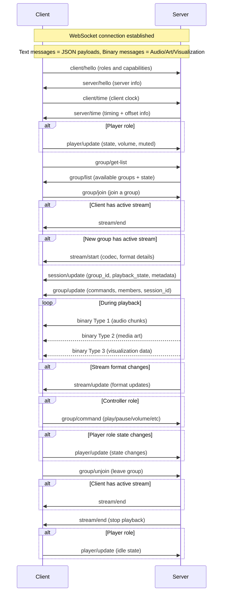

# The Resonate Protocol

_This is raw, unfiltered and experimental._

Resonate is a multi-room music experience protocol. The goal of the protocol is to orchestrate all devices that make up the music listening experience. This includes outputting audio on multiple speakers simultaneously, screens and lights visualizing the audio or album art, and wall tablets providing media controls.

# Definitions

- `Resonate Server` - orchestrates all devices. Generates an audio stream, manages all the players and clients, provides metadata etc.
- `Resonate Client` - a client that can play audio, visualize audio, display metadata, or provide music controls. It has different possible roles like player, metadata, controller, visualizer. Every client has a unique identifier.
  - Player - a particular type of client that receives audio and plays it in sync. Has its own volume and mute state and preferred format settings
  - Metadata - a particular type of client for displaying metadata. Has preferred format for cover art
  - Controller - a particular type of client for controlling Resonate groups.
  - Visualizer - a particular type of client for visualizing music. Has preferred format for the preferred audio features.
- `Resonate Group` - A group of clients. Each client belongs to exactly one group, and every group has at least one client. Every group has a unique identifier. Each group has the following states: list of member clients, volume, mute, and active session (may be null).
- `Resonate Session` - Session details the currently playing media and its playback state. Session has associated metadata. Session has a unique identifier. Each session is associated with exactly one group.
- `Resonate Stream` - Client specific details on how the server is formatting the binary data and as well as sending the binary data itself

# Establishing a Connection

Clients will announce their presence via mDNS on the `resonate` type.

Resonate communicates over WebSockets on the path `/resonate`. Recommend port is `8927`.

Resonate servers will also be able to connected to for supporting browsers, mobile apps, and other devices that can run a WebSocket client.

# Communication

Once the connection is established, Client and Server are going to talk.

Websocket Text messages are used to send JSON payloads.

Message format is as follows:

```javascript
{
  "type": "stream/start",
  "payload": { ... },
}
```

Websocket binary messages are used to send audio chunks. The first byte of the binary message is a uint8 that represents the message type.



## Client to Server: `client/hello`

Information about the Resonate client.
Players that can output audio should have the role `player`.

- `client_id` string, to uniquely identify the client for groups and de-duplication
- `name` string, friendly name of the client
- `version` number, version that the Resonate client implements
- `supported_roles` string[], at least one of:
  - `player` - Client that outputs audio
  - `controller` - Client that controls a group
  - `metadata` - Client that displays metadata
  - `visualizer` - Client that visualizes audio
- `player_support`: (only if `player` role is set)
  - `support_codecs` string[], Supported codecs listed in order of highest priority to lowest
  - `support_channels` number[], Number of channels (in order of priority)
  - `support_sample_rates` number[], Supported sample rates (also in order of priority)
  - `support_bit_depth` number[], Bit depth (also in order of priority)
  - `buffer_capacity` number, Buffer capacity size in bytes
- `metadata_support`: (only if `metadata` role is set)
  - `support_picture_formats` string[], Supported media art image formats
  - `media_width` number | null (null to receive original size)
  - `media_height` number | null (null to receive original size)
- `visualizer_support`: (only if `visualizer` role is set)
  - Desired FFT details (to be determined)
  - `buffer_capacity` number, Buffer capacity size in bytes


<!-- * `support_streams` string\[\] Supported streams (can be media, or voice (not supported now)). -->


## Server to Client: `server/hello`

Information about the server

- `server_id` the identifier of the server
- `name` the name of the server
- `version` the latest supported version of Resonate the server supports.

## Client to Server: `client/time`

Sends current internal clock timestamp (in microseconds) to server

- `client_transmitted` clients internal clock, in microseconds

## Server to Client: `server/time`

Response to the clients time message with info to establish a clock offsets

- `client_transmitted` clients internal clock timestamp received in the `client/time` message
- `server_received` timestamp that the server received the client/time message in microseconds
- `server_transmitted` timestamp that the server transmitted this message in microseconds

## Server to Client: `stream/start`

When a new stream starts.

- `player`: (Only sent to clients with the `player` role)
  - `codec`, string: codec to be used
  - `sample_rate`: number, sample rate to be used
  - `channels`, number: channels to be used
  - `bit_depth`, number: bit depth to be used
  - `codec_header`, Base64 string | null: Codec header (if necessary; e.g., FLAC)
- `visualizer`: (Only sent to clients with the `visualizer` role)
  - FFT details (to be determined)
- `metadata`: (Only sent to clients with the `metadata` role)
  - `art_format`, string: format of the encoded image `bmp`, `jpeg`, or `png`

## Server to Client: `stream/update`

When the format of the messages changes for the ongoing stream. Deltas updating only the relevant fields

- `player`: (Only sent to clients with the `player` role)
  - `codec`, string: codec to be used
  - `sample_rate`: number, sample rate to be used
  - `channels`, number: channels to be used
  - `bit_depth`, number: bit depth to be used
  - `codec_header`, Base64 string | null: Codec header (if necessary; e.g., FLAC)
- `visualizer`: (Only sent to clients with the `visualizer` role)
  - FFT details (to be determined)
- `metadata`: (Only sent to clients with the `metadata` role)
  - `art_format`, string: format of the encoded image `bmp`, `jpeg`, or `png`

## Server to Client: `stream/end`

Player should stop streaming and clear buffers - report idle state
Visualizer should stop visualizing and clear bufers

## Server to Client: `session/update`

This is deltas. Has to be merged into what exists. If a field is optional and has to be nullified, the value will be set to `null`. The server should null the metadata whenever a session is ended

- `group_id`
- `playback_state` (optional, only sent to clients with `controller` or `metadata` roles)
- `metadata` (optional, only sent to clients with `metadata` role)
  - `timestamp` number (server timestamp) for when this metadata is valid
  - `title` string; optional
  - `artist` string; optional
  - `album_artist` string; optional
  - `album` string; optional
  - `artwork_url` string; optional
  - `year` number; optional
  - `track` number; optional
  - `track_progress` number (in seconds); optional
  - `track_duration` number (in seconds); optional
  - `playback_speed` number (speed factor); optional
  - `repeat` `off` | `one` | `all`;
  - `shuffle` boolean;

## Server to Client: `group/update`
- `supported_commands` string[]: array containing a subset of the following group commands: `play` | `pause` | `stop` | `next` | `previous` | `seek` | `volume` | `mute`
- `members` []:
  - `client_id` - string
  - `name` - string
- `session_id` - string | null; null if no active session

## Client to Server: `group/command`

Control the group that's playing. Only valid from clients that have the `controller` role.
- `command` string: one of the values listed in `group/update` field `supported_commands`
- `volume`, number: Volume range: 0-100 (integer); optional, only set if `command` is `volume`
- `mute`, boolean: True to mute, false to unmute; optional, only set if `command` is `mute`

## Client to Server: `player/update`

Client has the `player` role to inform the server of a state change.

Clients with the `player` role must send this immediately after receiving a `server/hello` message and whenever any of these states change

- `state` string: one of `playing` if there is an active stream or `idle` if there is no active stream
- `volume` integer 0-100
- `muted` boolean

## Client to Server: `group/get-list`

Request all groups available to join on the server

## Server to Client: `group/list`

All groups available to join on the server

- Include state of each group: playing, paused, or idle

## Client to Server: `group/join`

When a client wants to join a group

Response is a `stream/end` message (if the client has an active stream) and a `stream/start` message (if the new group has an active stream).

## Client to Server: `group/unjoin`

When a client wants to leave group

Response is a `stream/end` message (if the client has an active stream)

<!-- ## Server to Client: `volume/set`

* `volume`, number: Volume range: 1-100 (integer)

## Server to Client: `mute/set`

* `Mute`, bool -->

## Server to Client: binary message

If there is no active stream, binary messages should be rejected.
Range is inclusive of both start and end.

- Byte 0: message type
- Byte 1-8: timestamp (big endian signed int64)

### Binary message: audio chunk. Type 1
- Rest of bytes: encoded audio frame
### Binary message: media art. Type 2
- Rest of bytes: encoded image
### Binary message: visualization. Type 3
- Rest of bytes: visualizatoin data


