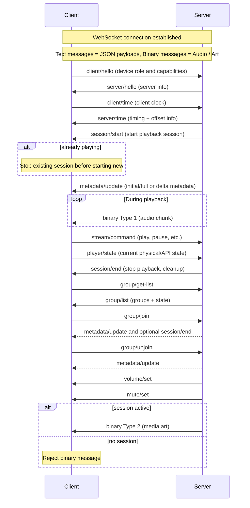

# The Resonate Protocol

_This is raw, unfiltered and experimental._

Resonate is a multi-room music experience protocol. The goal of the protocol is to orchestrate all devices that make up the music listening experience. This includes outputting audio on multiple speakers simultaneously, screens and lights visualizing the audio or album art, and wall tablets providing media controls.

# Definitions

* Server: a Resonate server. Orchestrates all devices. Generates an audio stream, manages all the players and clients, provides metadata etc.
* Client: a Resonate client that can play audio, visualize audio or album art or provide music controls

# Establishing a Connection

Clients will announce their presence via mDNS on the `resonate` type.

Resonate communicates over WebSockets on the path `/resonate`. Recommend port is `8927`.

Resonate servers will also be able to connected to for supporting browsers, mobile apps, and other devices that can run a WebSocket client.

# Communication

Once the connection is established, Client and Server are going to talk.

Websocket Text messages are used to send JSON payloads.

Message format is as follows:

```javascript
{
  "type": "session/start",
  "payload": { ... },
}
```

Websocket binary messages are used to send audio chunks. The first byte of the binary message is a uint8 that represents the message type.



## Client to Server: `client/hello`

Information about the Resonate client.
Players that can output audio should have the role `play`.

* `client_id` string, to uniquely identify the client for groups and de-duplication
* `name` string,
* `support_codecs` string\[\], Supported codecs listed in order of highest priority to lowest
* `support_channels` number\[\], Number of channels (in order of priority)
* `support_sample_rates` number\[\], Supported sample rates (also in order of priority)
* `support_bit_depth` number\[\], Bit depth (also in order of priority)
* `buffer_capacity` number, Buffer capacity size in bytes
* `role` string, one of:
  * `"play"` - Device that can output audio/music and may also control and visualize it
* `support_streams` string\[\] Supported streams (can be media, or voice (not supported now)).
* `support_picture_formats` string\[\], Supported media art image formats
* `media_display_size` string | null, Cover media display size (null for none)

## Server to Client: `server/hello`

Information about the server

* `server_id` the identifier of the server
* `name` the name of the server

## Client to Server: `client/time`

Sends current internal clock timing (in microseconds) to server

* `client_transmitted` clients internal clock, in microseconds

## Server to Client: `server/time`

Response to the clients time message with info to establish a clock offsets

* `client_transmitted` clients internal clock, in microseconds
* `server_received` timestamp that the server received the client/time message
* `server_transmitted` timestamp that the server transmitted this message

## Server to Client: `session/start`

When a client needs to start playing.

* `session_id`, string: identifier for the session
* `codec`, string: codec to be used
* `sample_rate`: number, sample rate to be used
* `channels`, number: channels to be used
* `bit_depth`, number: bit depth to be used
* `now`, signed bigint64: current time on the server as unix timestamp in microseconds
* `codec_header`, XXXX | null: Codec header (if necessary; e.g., FLAC). Encoded as a Base64 string.

Edge cases:

* If a client receives a session/start while it’s already playing that stream type, it should stop the existing one and adopt new one.

## Server to Client: `session/end`

Client should stop streaming, clear metadata etc.

## Server to Client: `metadata/update`

This is deltas. Has to be merged into what exists. Server ensures first one is the full one. If a field is optional and has to be nullified, the value will be set to `null`.

Paulus: I just added some fields to get ball rolling
Paulus: should all fields be included or be partial updates?

* `title` string; optional
* `artist` string; optional
* `album` string; optional
* `year` number; optional
* `track` number; optional
* `group_members` string\[\]: client IDs
* `support_commands` string\[\]: array containing a subset of these: "play" | "pause" | "stop" | "seek" | "volume"
* `repeat` "off" | "one" | "all";
* `shuffle` boolean;

## Client to Server: `stream/command`

Control the stream that we’re playing

* `command` one values listed in `metadata/update` field `support_commands`

## Client to Server: `player/state`

The player can be controlled via physical controls or other remote APIs, like ESPHome API via HA. For example, the player will tell server that it got controlled.

Paulus: should all fields be included or be partial updates?

* `state`
  * `playing` active session, and outputting
  * `paused` active session, not consuming buffer
  * `idle` no active session
* `volume` integer 0-100
* `muted` boolean

## Client to Server: `group/get-list`

Request all groups available to join on the server

## Server to Client: `group/list`

All groups available to join on the server

* Include state of each group: playing, paused, or idle

## Client to Server: `group/join`

When a client wants to join a group

Response is a metadata/update. You will also get a response end message if a stream is playing.

## Client to Server: `group/unjoin`

When a client wants to leave group

Response is a metadata/update

## Server to Client: `volume/set`

* `volume`, number: Volume range: 1-100 (integer)

## Server to Client: `mute/set`

* `Mute`, bool

## Server to Client: binary message

If no session is playing, the binary message should be rejected.
Range is inclusive of both start and end.

* Byte 0: message type

### Binary message media art. Type 2

* Byte 1: codec
* Rest of bytes: art

### Binary message: audio chunk. Type 1

* Byte 1-8: timestamp (signed int64)
* Byte 9-12: number of samples (per channel) in chunk
* Rest of bytes: encoded audio frame
