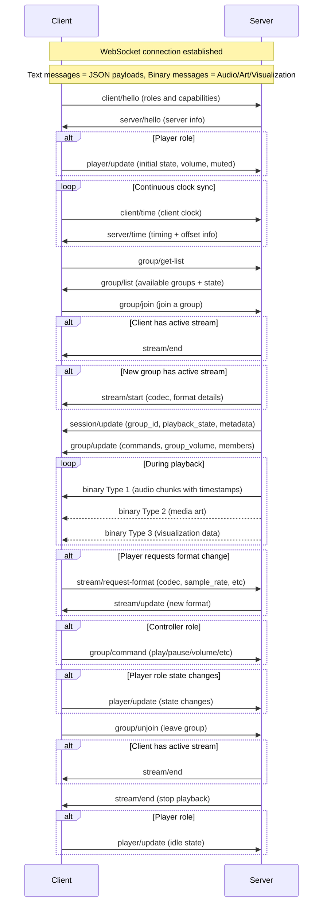

# The Resonate Protocol

_This is raw, unfiltered and experimental._

Resonate is a multi-room music experience protocol. The goal of the protocol is to orchestrate all devices that make up the music listening experience. This includes outputting audio on multiple speakers simultaneously, screens and lights visualizing the audio or album art, and wall tablets providing media controls.

## Definitions

- **Resonate Server** - orchestrates all devices, generates audio streams, manages players and clients, provides metadata
- **Resonate Client** - a client that can play audio, visualize audio, display metadata, or provide music controls. Has different possible roles (player, metadata, controller, visualizer). Every client has a unique identifier
  - **Player** - receives audio and plays it in sync. Has its own volume and mute state and preferred format settings
  - **Controller** - controls the Resonate group this client is part of
  - **Metadata** - displays metadata. Has preferred format for cover art
  - **Visualizer** - visualizes music. Has preferred format for audio features
- **Resonate Group** - a group of clients. Each client belongs to exactly one group, and every group has at least one client. Every group has a unique identifier. Each group has the following states: list of member clients, volume, mute, and active session (may be null)
- **Resonate Session** - details the currently playing media and its playback state. Has associated metadata and a unique identifier. Each session is associated with exactly one group
- **Resonate Stream** - client-specific details on how the server is formatting and sending binary data. Each client receives its own independently encoded stream based on its capabilities and preferences. The server sends audio chunks as far ahead as the client's buffer capacity allows

## Establishing a Connection

Resonate has two standard ways to establish connections: Server and Client initiated.

Resonate Servers must support both methods described below.

### Server Initiated Connections

Clients announce their presence via mDNS using:
- Service type: `_resonate._tcp.local.`
- Port: The port the Resonate client is listening on (recommended: `8927`)
- TXT records:
  - `path` key specifying the WebSocket endpoint (recommended: `/resonate`)
  - `client_id` key specifying the unique client identifier, same as used in the `client/hello` message
  - `name` key specifying a friendly name for the client, same as used in the `client/hello` message

The server discovers available clients through mDNS and connects to each client via WebSocket using the advertised address and path.

**Note:** Do not manually connect to servers if you are advertising `_resonate._tcp`.

### Client Initiated Connections

If clients prefer to initiate the connection instead of waiting for the server to connect, the server must be discoverable via mDNS using:
- Service type: `_resonate-server._tcp.local.`
- Port: The port the Resonate server is listening on (recommended: `8927`)
- TXT record: `path` key specifying the WebSocket endpoint (recommended: `/resonate`)

Clients discover the server through mDNS and initiate a WebSocket connection using the advertised address and path.

**Note:** Do not advertise `_resonate._tcp` if the client plans to initiate the connection.

**Note:** After this point, Resonate works independently of how the connection was established. The Resonate client is always the consumer of data like audio or metadata, regardless of who initiated the connection.

While custom connection methods are possible for specialized use cases (like remotely accessible web-browsers, mobile apps), most clients should use one of the two standardized methods above if possible.

## Communication

Once the connection is established, Client and Server are going to talk.

The first message must always be a `client/hello` message from the client to the server.
Once the server receives this message, it responds with a `server/hello` message. Before this handshake is complete, no other messages should be sent.

WebSocket text messages are used to send JSON payloads.

**Note:** In field definitions, `?` indicates an optional field (e.g., `field?`: type means the field may be omitted).

Message format:

```json
{
  "type": "stream/start",
  "payload": { ... }
}
```

WebSocket binary messages are used to send audio chunks, media art, and visualization data. The first byte is a uint8 representing the message type.

## Clock Synchronization

Clients continuously send `client/time` messages to maintain an accurate offset from the server's clock. The frequency of these messages is determined by the client based on network conditions and clock stability.

Binary audio messages contain timestamps in the server's time domain indicating when the audio should be played. Clients use their computed offset to translate server timestamps to their local clock for synchronized playback.

## Playback Synchronization

- Each client is responsible for maintaining synchronization with the server's timestamps
- Clients maintain accurate sync by adding or removing samples using interpolation to compensate for clock drift
- When a client cannot maintain sync (e.g., buffer underrun), it should mute its audio output and continue buffering until it can resume synchronized playback
- The server is unaware of individual client sync synchronized accuracy - it simply broadcasts timestamped audio
- Late-joining clients receive audio with future timestamps only, allowing them to start playback in sync with existing clients



## Core messages
This section describes the fundamental messages that establish communication between clients and the server. These messages handle initial handshakes, ongoing clock synchronization, and stream lifecycle management. Every Resonate client and server must implement all messages in this section regardless of their specific roles. Role-specific payload details are documented in their respective role sections.

### Client → Server: `client/hello`

First message sent by the client after establishing the WebSocket connection. Contains information about the client's capabilities and roles.
This message will be followed by a [`server/hello`](#server--client-serverhello) message from the server.

Players that can output audio should have the role `player`.

- `client_id`: string - uniquely identifies the client for groups and de-duplication
- `name`: string - friendly name of the client
- `device_info?`: object - optional information about the device
  - `product_name?`: string - device model/product name
  - `manufacturer?`: string - device manufacturer name
  - `software_version?`: string - software version of the client (not the Resonate version)
- `version`: integer - version that the Resonate client implements
- `supported_roles`: string[] - at least one of:
  - `player` - outputs audio
  - `controller` - controls the current Resonate group
  - `metadata` - displays metadata
  - `visualizer` - visualizes audio
- `player_support?`: object - only if `player` role is set ([see player support object details](#client--server-clienthello-player-support-object))
- `metadata_support?`: object - only if `metadata` role is set ([see metadata support object details](#client--server-clienthello-metadata-support-object))
- `visualizer_support?`: object - only if `visualizer` role is set ([see visualizer support object details](#client--server-clienthello-visualizer-support-object))

### Client → Server: `client/time`

Sends current internal clock timestamp (in microseconds) to server.
Once received by the server, the server responds with a [`server/time`](#server--client-servertime) message containing timing information to establish clock offsets.

- `client_transmitted`: integer - client's internal clock timestamp in microseconds

### Server → Client: `server/hello`

Response to the [`client/hello`](#client--server-clienthello) message with information about the server.

Only after receiving this message should the client send any other messages (including [`client/time`](#client--server-clienttime) and the initial [`player/update`](#client--server-playerupdate) message if the client has the `player` role).

- `server_id`: string - identifier of the server
- `name`: string - friendly name of the server
- `version`: integer - latest supported version of Resonate

### Server → Client: `server/time`

Response to the [`client/time`](#client--server-clienttime) message with timestamps to establish clock offsets.

For synchronization, all timing is relative to the server's monotonic clock. These timestamps have microsecond precision and are not necessarily based on epoch time.

- `client_transmitted`: integer - client's internal clock timestamp received in the `client/time` message
- `server_received`: integer - timestamp that the server received the `client/time` message in microseconds
- `server_transmitted`: integer - timestamp that the server transmitted this message in microseconds

### Server → Client: `stream/start`

When a new stream starts.

- `player?`: object - only sent to clients with the `player` role ([see player object details](#server--client-streamstart-player-object))
- `metadata?`: object - only sent to clients with the `metadata` role that specified supported picture formats ([see metadata object details](#server--client-streamstart-metadata-object))
- `visualizer?`: object - only sent to clients with the `visualizer` role ([see visualizer object details](#server--client-streamstart-visualizer-object))

### Server → Client: `stream/update`

When the format of the messages changes for the ongoing stream. Deltas updating only the relevant fields.

- `player?`: object - only sent to clients with the `player` role ([see player object details](#server--client-streamupdate-player-object))
- `metadata?`: object - only sent to clients with the `metadata` role that specified supported picture formats ([see metadata object details](#server--client-streamupdate-metadata-object))
- `visualizer?`: object - only sent to clients with the `visualizer` role ([see visualizer object details](#server--client-streamupdate-visualizer-object))

### Server → Client: `stream/end`

Player should stop streaming and clear buffers - report idle state.
Visualizer should stop visualizing and clear buffers.

No payload.

### Server → Client: `session/update`

Delta updates that must be merged into existing state. Fields set to `null` should be nullified. The server should null the metadata whenever a session is ended.

- `group_id`: string - group identifier
- `playback_state?`: 'playing' | 'paused' | 'stopped' - only sent to clients with `controller` or `metadata` roles
- `metadata?`: object - only sent to clients with `metadata` role ([see metadata object details](#server--client-sessionupdate-metadata-object))

## Player messages
This section describes messages specific to clients with the `player` role, which handle audio output and synchronized playback. Player clients receive timestamped audio data, manage their own volume and mute state, and can request different audio formats based on their capabilities and current conditions.

### Client → Server: `client/hello` player support object

The `player_support` object in [`client/hello`](#client--server-clienthello) has this structure:

- `player_support`: object
  - `support_codecs`: string[] - supported codecs in priority order
  - `support_channels`: integer[] - number of channels in priority order
  - `support_sample_rates`: integer[] - supported sample rates in priority order
  - `support_bit_depth`: integer[] - bit depth in priority order
  - `buffer_capacity`: integer - max size in bytes of compressed audio messages in the buffer, that are yet to be played
  - `supported_commands`: string[] - subset of: `volume`, `mute`

### Client → Server: `player/update`

Informs the server of player state changes. Only for clients with the `player` role.
This message must always be sent after establishing the connection and state updates, including when the volume was changed through a `player/command` received from the server or when a volume button was pressed locally.

Must be sent immediately after receiving `server/hello` and whenever any state changes.

- `state`: 'playing' | 'idle' - playing if active stream, idle if no active stream
- `volume`: integer - range 0-100
- `muted`: boolean - mute state

### Client → Server: `stream/request-format`

Request different stream format (upgrade or downgrade). Only for clients with the `player` role.

- `codec?`: string - requested codec
- `sample_rate?`: integer - requested sample rate
- `channels?`: integer - requested channels
- `bit_depth?`: integer - requested bit depth

Response: `stream/update` with the new format.

**Note:** Clients should use this message to adapt to changing network conditions or CPU constraints. The server maintains separate encoding for each client, allowing heterogeneous device capabilities within the same group.

### Server → Client: `player/command`

Request the player to perform an action, e.g., change volume or mute state.

- `command`: 'volume' | 'mute' - must be one of the values listed in `supported_commands` in the [`player_support`](#client--server-clienthello-player-support-object) object in the [`client/hello`](#client--server-clienthello) message
- `volume?`: integer - volume range 0-100, only set if `command` is `volume`
- `mute?`: boolean - true to mute, false to unmute, only set if `command` is `mute`

### Server → Client: `stream/start` player object

The `player` object in [`stream/start`](#server--client-streamstart) has this structure:

- `player`: object
  - `codec`: string - codec to be used
  - `sample_rate`: integer - sample rate to be used
  - `channels`: integer - channels to be used
  - `bit_depth`: integer - bit depth to be used
  - `codec_header?`: string - Base64 encoded codec header (if necessary; e.g., FLAC)

### Server → Client: `stream/update` player object

The `player` object in [`stream/update`](#server--client-streamupdate) has this structure with delta updates:

- `player`: object
  - `codec`: string - codec to be used
  - `sample_rate`: integer - sample rate to be used
  - `channels`: integer - channels to be used
  - `bit_depth`: integer - bit depth to be used
  - `codec_header?`: string - Base64 encoded codec header (if necessary; e.g., FLAC)

### Server → Client: Audio Chunks (Binary)

Binary messages should be rejected if there is no active stream.

- Byte 0: message type `1` (uint8)
- Bytes 1-8: timestamp (big-endian int64) - server clock time in microseconds when this data should be presented/played
- Rest of bytes: encoded audio frame

The timestamp indicates when exactly the first sample in the chunk should leave the device.

## Controller messages
This section describes messages specific to clients with the `controller` role, which enables the client to control the Resonate group this client is part of, and basic switching between groups.

Every client which lists the `controller` role in the `supported_roles` of the `client/hello` message needs to implement all messages in this section.

### Client → Server: `group/command`

Control the group that's playing. Only valid from clients with the `controller` role.

- `command`: 'play' | 'pause' | 'stop' | 'next' | 'previous' | 'volume' | 'mute' | `repeat_off` | `repeat_one` | `repeat_all` | `shuffle` | `unshuffle` - must be one of the values listed in `group/update` field `supported_commands`
- `volume?`: integer - volume range 0-100, only set if `command` is `volume`
- `mute?`: boolean - true to mute, false to unmute, only set if `command` is `mute`

### Client → Server: `group/switch`

Request the server to switch this client to a different group.

For a client with the `player` role this will:
- Cycle the group this client is part of through all combinations of: all other playing groups, all other playing players, and just itself
For a client without the `player` role this will:
- Cycle the group this client is part of through all combinations of: all other playing groups, and all other playing players

No payload.

### Server → Client: `group/update`

Group state update.

- `supported_commands`: string[] - subset of: 'play' | 'pause' | 'stop' | 'next' | 'previous' | 'volume' | 'mute' | `repeat_off` | `repeat_one` | `repeat_all` | `shuffle` | `unshuffle` 
- `volume`: integer - range 0-100
- `muted`: boolean - mute state


## Metadata messages
This section describes messages specific to clients with the `metadata` role, which handle display of track information, artwork, and playback state. Metadata clients receive session updates with track details and can optionally receive artwork in their preferred format and resolution.

### Client → Server: `client/hello` metadata support object

The `metadata_support` object in [`client/hello`](#client--server-clienthello) has this structure:

- `metadata_support`: object
  - `support_picture_formats`: string[] - supported media art image formats (empty array if no art desired)
  - `media_width?`: integer - max width in pixels (if only width set, scales preserving aspect ratio)
  - `media_height?`: integer - max height in pixels (if only height set, scales preserving aspect ratio)

### Server → Client: `stream/start` metadata object

The `metadata` object in [`stream/start`](#server--client-streamstart) (sent to clients that specified supported picture formats) has this structure:

- `metadata`: object
  - `art_format`: 'bmp' | 'jpeg' | 'png' - format of the encoded image

### Server → Client: `stream/update` metadata object

The `metadata` object in [`stream/update`](#server--client-streamupdate) has this structure with delta updates:

- `metadata`: object
  - `art_format`: 'bmp' | 'jpeg' | 'png' - format of the encoded image

### Server → Client: `session/update` metadata object

The `metadata` object in [`session/update`](#server--client-sessionupdate) has this structure:

Clients can calculate the current track position at any time using the last received values: `current_track_progress_ms = max(min(metadata.track_progress + (current_time - metadata.timestamp) * metadata.playback_speed / 1000000, metadata.track_duration), 0)`

- `metadata`: object
  - `timestamp`: integer - server clock time in microseconds for when this metadata is valid
  - `title?`: string | null - track title
  - `artist?`: string | null - primary artist(s)
  - `album_artist?`: string | null - album artist(s)
  - `album?`: string | null - album name
  - `artwork_url?`: string | null - URL to artwork image. Useful for clients that want to forward metadata to external systems or for powerful clients that can fetch and process images themselves
  - `year?`: integer | null - release year
  - `track?`: integer | null - track number
  - `track_progress?`: integer | null - current playback position in milliseconds (since start of track, at the given `timestamp`)
  - `track_duration?`: integer | null - total track length in milliseconds
  - `playback_speed?`: integer | null - playback speed multiplier * 1000 (e.g., 1000 = normal speed, 1500 = 1.5x speed, 500 = 0.5x speed)
  - `repeat?`: 'off' | 'one' | 'all' | null - repeat mode
  - `shuffle?`: boolean | null - shuffle mode enabled/disabled

### Server → Client: Media Art (Binary)

Binary messages should be rejected if there is no active stream.

- Byte 0: message type `2` (uint8)
- Bytes 1-8: timestamp (big-endian int64) - server clock time in microseconds when this data should be presented/played
- Rest of bytes: encoded image

The timestamp indicates when this artwork becomes valid for display.

## Visualizer messages
This section describes messages specific to clients with the `visualizer` role, which create visual representations of the audio being played. Visualizer clients receive audio analysis data like FFT information that corresponds to the current audio timeline.

### Client → Server: `client/hello` visualizer support object

The `visualizer_support` object in [`client/hello`](#client--server-clienthello) has this structure:

- `visualizer_support`: object
  - Desired FFT details (to be determined)
  - `buffer_capacity`: integer - max size in bytes of visualization data messages in the buffer, that are yet to be displayed

### Server → Client: `stream/start` visualizer object

The `visualizer` object in [`stream/start`](#server--client-streamstart) has this structure:

- `visualizer`: object
  - FFT details (to be determined)

### Server → Client: `stream/update` visualizer object

The `visualizer` object in [`stream/update`](#server--client-streamupdate) has this structure with delta updates:

- `visualizer`: object
  - FFT details (to be determined)

### Server → Client: Visualization Data (Binary)

Binary messages should be rejected if there is no active stream.

- Byte 0: message type `3` (uint8)
- Bytes 1-8: timestamp (big-endian int64) - server clock time in microseconds when this data should be presented/played
- Rest of bytes: visualization data

The timestamp indicates when this visualization data corresponds to the audio.
