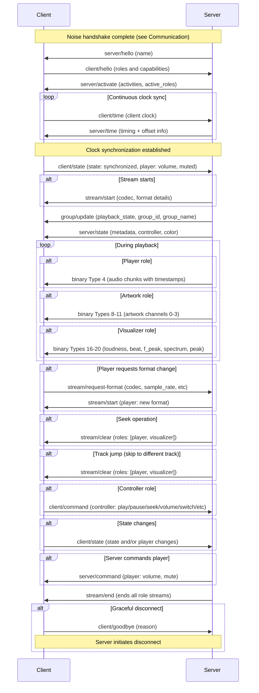
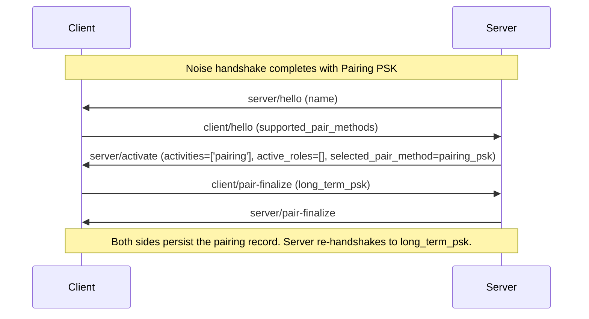
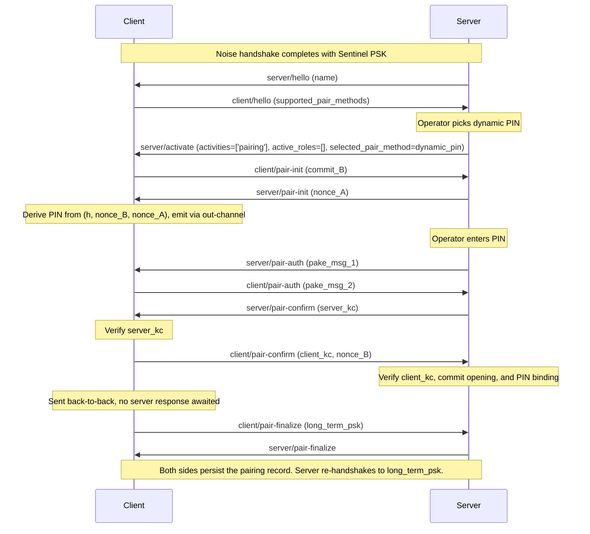
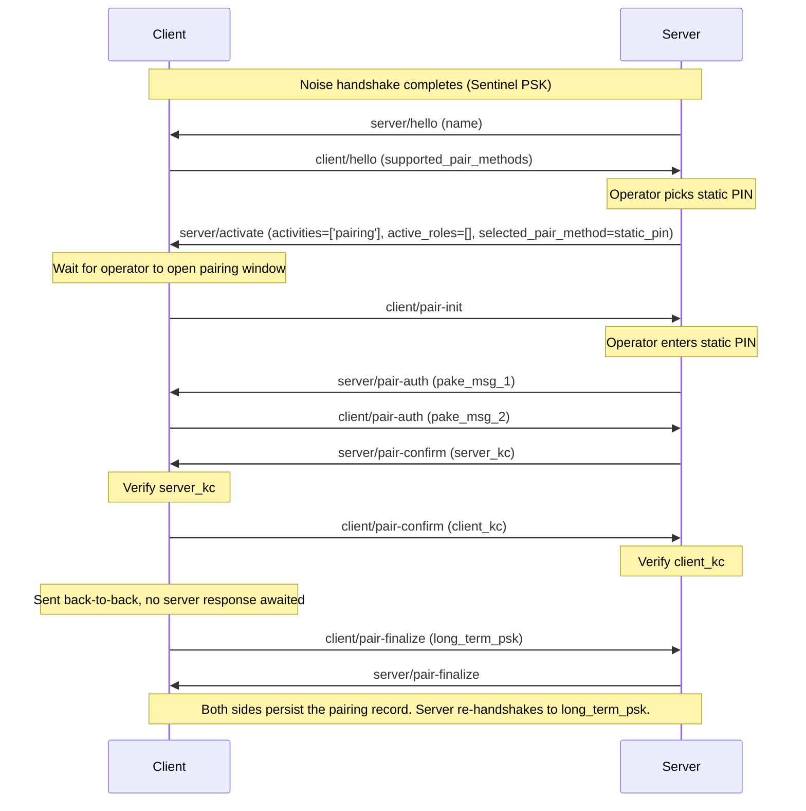

# The Sendspin Protocol

Sendspin is a multi-room music experience protocol. The goal of the protocol is to orchestrate all devices that make up the music listening experience. This includes outputting audio on multiple speakers simultaneously, screens and lights visualizing the audio or album art, and wall tablets providing media controls.

## Definitions

- **Sendspin Server** - orchestrates all devices, generates audio streams, manages players and clients, provides metadata
- **Sendspin Client** - a client that can play audio, visualize audio, display metadata, display colors, or provide music controls. Has different possible roles (player, metadata, controller, artwork, visualizer, color). Every client has a unique identifier
  - **Player** - receives audio and plays it in sync. Has its own volume and mute state and preferred format settings
  - **Controller** - controls the Sendspin group this client is part of
  - **Metadata** - displays text metadata (title, artist, album, etc.)
  - **Artwork** - displays artwork images. Has preferred format for images
  - **Visualizer** - visualizes music. Has preferred format for audio features
  - **Color** - receives colors derived from the current audio
- **Sendspin Group** - a group of clients. Each client belongs to exactly one group, and every group has at least one client. Every group has a unique identifier. Each group has the following states: list of member clients, volume, mute, and playback state
- **Sendspin Stream** - client-specific details on how the server is formatting and sending binary data. Each role's stream is managed separately. Each client receives its own independently encoded stream based on its capabilities and preferences. For players, the server sends audio chunks as far ahead as the client's buffer capacity allows. For artwork clients, the server sends album artwork and other visual images through the stream
- **Sendspin Identity** - a Curve25519 keypair used to identify a client or server in the [Noise](#encryption) handshake. The base64url-encoded public key (43 characters, no padding) serves as the `client_id` or `server_id`. Persistent across reboots
- **Sendspin PSK** - a 32-byte pre-shared symmetric secret shared between a (client, server) pair, established during [pairing](#pairing) and mixed into the [Noise](#encryption) handshake state for every subsequent connection. Must be drawn from a CSPRNG or equivalent high-entropy source.
- **Sendspin Pairing PSK** - a 32-byte symmetric secret used as the PSK in the [Pairing PSK pairing method](#pairing). It is always distributed alongside the client's static public key (`client_id`), which the server needs to verify the client identity. The operator enters it into the server by copying a string or scanning a QR code. Distinct from the per-pair Sendspin PSK that pairing produces. Must be drawn from a CSPRNG or equivalent high-entropy source.
- **Sendspin Pairing PIN** - a decimal-digit value used in PIN-based [pairing](#pairing) methods. The static-PIN method uses a fixed 8-digit value; the dynamic-PIN method uses a per-session generated value of variable length (see [Dynamic PIN Pairing Flow](#dynamic-pin-pairing-flow)).
- **Sendspin Trust Level** - one of `user` or `none`, expressing the trust the client extends to the server. Ordered `none < user`. `user` means a pairing record exists for the server; `none` means none does, restricting the server to a pairing exchange or, when [unpaired access](#unpaired-access) is enabled, normal playback and control flows.

## Role Versioning

Roles define what capabilities and responsibilities a client has. All roles use explicit versioning with the `@` character: `<role>@<version>` (e.g., `player@v1`, `controller@v1`).

This specification defines the following roles: [`player`](#player-messages), [`controller`](#controller-messages), [`metadata`](#metadata-messages), [`artwork`](#artwork-messages), [`visualizer`](#visualizer-messages), [`color`](#color-messages). All servers must implement all versions of these roles described in this specification.

All role names and versions not starting with `_` are reserved for future revisions of this specification.

### Priority and Activation

Clients list roles in `supported_roles` in priority order (most preferred first). If a client supports multiple versions of a role, all should be listed: `["player@v2", "player@v1"]`.

The server activates at most one version per role family (e.g., one `player@vN`, one `controller@vN`) - the first match it implements from the client's list, or none if server policy declines to activate that family. The server reports activated roles in `active_roles`; clients MUST consult it and refrain from sending commands or state for roles that aren't active.

Message object keys (e.g., `player?`, `controller?`) use unversioned role names. The server determines the appropriate version from the client's `active_roles`.

### Detecting Outdated Servers

Servers should track when clients request roles or role versions they don't implement (excluding those starting with `_`). This indicates the client supports a newer version of the specification and the server needs to be updated.

### Application-Specific Roles

Custom roles outside the specification start with `_` (e.g., `_myapp_controller`, `_custom_display`). Application-specific roles can also be versioned: `_myapp_visualizer@v2`.

## Establishing a Connection

Sendspin has two standard ways to establish connections: Server and Client initiated. Server Initiated connections are recommended as they provide standardized multi-server behavior, but require mDNS which may not be available in all environments.

Sendspin Servers must support both methods described below.

### Server Initiated Connections

Clients announce their presence via mDNS using:
- Service type: `_sendspin._tcp.local.`
- Port: The port the Sendspin client is listening on (recommended: `8928`)
- TXT record: `path` key specifying the WebSocket endpoint (recommended: `/sendspin`)
- TXT record: `name` key specifying the friendly name of the player (optional)

The server discovers available clients through mDNS and connects to each client via WebSocket using the advertised address and path.

**Note:** Do not manually connect to servers if you are advertising `_sendspin._tcp`.

#### Multiple servers

A client holds at most one admitted connection at a time, classified by the highest-ranked activity in its declared [`activities`](#server--client-serveractivate); from highest to lowest:

- `'management'`
- `'playback'`
- `'pairing'`

A connection with empty `activities` ranks lowest.

Clients must persistently store the `server_id` of the server that most recently held the admitted connection while `'playback'` was among its `activities` (the "last-playback server").

When a new server connects, the client lets the handshake complete before applying admission; the new connection is provisional until its first [`server/activate`](#server--client-serveractivate) declares its priority. The incoming connection's priority is compared to the current connection's: higher or equal is accepted, lower is rejected. Two exceptions:

- An in-flight pairing is not displaced by an incoming `'playback'` or `'pairing'` connection.
- When both the current holder and the incoming connection have empty `activities`, the incoming is admitted only if its `server_id` matches the last-playback server (and the existing one's does not); otherwise the existing is kept.

Subsequent `server/activate` updates do not trigger arbitration. A provisional connection that has not sent `server/activate` within 30 seconds is dropped.

A displaced connection receives [`client/goodbye`](#client--server-clientgoodbye) reason `'another_server'` (or [`pair/abort`](#client--server-pairabort) reason `concurrent_attempt` if it is a pairing handshake). A rejected incoming receives [`client/goodbye`](#client--server-clientgoodbye) reason `'concurrent_attempt'` (or [`pair/abort`](#client--server-pairabort) reason `concurrent_attempt` for pairings). The client then closes the connection.

### Client Initiated Connections

If clients prefer to initiate the connection instead of waiting for the server to connect, the server must be discoverable via mDNS using:
- Service type: `_sendspin-server._tcp.local.`
- Port: The port the Sendspin server is listening on (recommended: `8927`)
- TXT record: `path` key specifying the WebSocket endpoint (recommended: `/sendspin`)
- TXT record: `name` key specifying the friendly name of the server (optional)

Clients discover the server through mDNS and initiate a WebSocket connection using the advertised address and path.

**Note:** Do not advertise `_sendspin._tcp` if the client plans to initiate the connection.

#### Multiple servers

Unlike server-initiated connections, servers cannot reclaim clients by reconnecting. How clients handle multiple discovered servers, server selection, and switching is implementation-defined.

**Note:** After this point, Sendspin works independently of how the connection was established. The Sendspin client is always the consumer of data like audio or metadata, regardless of who initiated the connection.

## Encryption

All Sendspin connections use end-to-end encryption based on the [Noise Protocol Framework](https://noiseprotocol.org/noise.html). Encryption is mandatory for all connections established through the standard discovery mechanisms described in [Establishing a Connection](#establishing-a-connection).

### Pattern

Sendspin uses the `KKpsk2` Noise pattern. Both static keys are pre-known to both parties (the `client_id` of the client and the `server_id` of the server are the static public keys), and a [Pre-Shared Key](#pre-shared-key) is mixed in at the end of the handshake's second message.

The **server is the Noise initiator**, the **client is the Noise responder**, regardless of which side initiated the WebSocket connection.

**Security properties.** Forward secrecy is provided by the ephemeral-key DH in each handshake: compromise of static keys or the PSK does not retroactively decrypt prior sessions. Replay protection is provided by Noise's per-direction transport counter; a repeated or out-of-order ciphertext fails AEAD decryption and aborts the connection.

### Cipher Suites

A suite specifies the `<DH>_<cipher>_<hash>` part of the full Noise protocol name. Sendspin defines two:

- `25519_ChaChaPoly_SHA256` - software-friendly suite
- `25519_AESGCM_SHA256` - hardware-accelerated suite (AES-NI / ARMv8 Crypto Extensions)

Servers must support both suites. Clients must support at least one.

The client picks one suite and announces it in [`client/init`](#client--server-clientinit); since servers are required to support every suite, no negotiation is needed.

### Identities

The `client_id` and `server_id` fields are the base64url-encoded (no padding) Curve25519 public keys of the client and server respectively, 43 characters each. These keys serve both as routing/persistence identifiers and as the static keys used in the Noise handshake.

**Key rotation.** Each side's static keypair is intended to be long-lived; the identifier is the pubkey, so rotating the keypair changes the identity. A server that rotates its static keypair (e.g., reprovisioned hardware, migrated host, lost private key) appears to clients as a different server. Operators who want to preserve identity across server moves must preserve the server's static private key (e.g., as part of the server's backup/restore set).

### Pre-Shared Key

The PSK is mixed into the handshake state at the end of the second handshake message (the `psk2` modifier). The transport-mode keys derived after the handshake therefore include the PSK, but the first handshake message's payload (sent by the server) is encrypted under static-key DH only.

To let the client select the right PSK before the PSK must be mixed in, the server includes a `psk_id` in the first handshake message's payload. The identifier is a 43-character base64url-encoded value (no padding) of a 32-byte SHA-256 output, derived deterministically from the PSK:

```
psk_id = base64url(SHA-256("sendspin-psk-id-v1" || PSK))
```

The label is the UTF-8 byte sequence of the literal characters shown (no NUL terminator, no surrounding quotes); `||` denotes byte concatenation. The same formula applies to all three PSK categories (long-term, Pairing, Sentinel); the client stores each of its PSKs tagged with its category and, on match, the stored category determines how to proceed. The single handshake pattern (`KKpsk2`) is used in all three cases; only the PSK input differs.

The **Sentinel PSK** is a published constant used as the PSK input whenever no other PSK applies - i.e., before any pairing record exists. It provides no authentication on its own (its value is public); authentication, when needed, is established later during [Pairing](#pairing). The sentinel value is:

```
Sentinel PSK = SHA-256("sendspin-sentinel-psk-v1")
             = 0x1b5e24dbc1aed95fc2a5a338a90c05df44bd10f5ec1f4cd66cbf86272767b9d3
```

and its `psk_id` is therefore also a published constant:

```
Sentinel psk_id = 0x185b15f6d2da4909bd1dc156a4ab206103abef0153bcd52d926170b95cf7ce8a
                = base64url "GFsV9tLaSQm9HcFWpKsgYQOr7wFTvNUtkmFwuVz3zoo"
```

The client decrypts the first handshake message's payload using only the static keys, compares the included `psk_id` to hashes of each of its candidate PSKs, and selects the PSK whose hash matches. It then mixes that PSK as required to process the second handshake message. If no candidate matches, the handshake fails.

Two storage variants are supported for long-term [Sendspin PSK](#definitions) records, distinguished by whether the client also stores the server's `server_id`. The wire bytes and `psk_id` lookup are identical; only the post-match check differs.

- **Stored-pubkey model**: each long-term PSK is persisted alongside the server's `server_id`. After a `psk_id` match, the client verifies that the matched PSK's stored `server_id` equals the one in [`server/init`](#server--client-serverinit); mismatch fails the handshake. Authentication relies on both the static keys and the PSK.
- **Shared-PSK model**: PSKs are persisted without an associated `server_id`; the `server_id` from [`server/init`](#server--client-serverinit) is accepted at face value. Convenient for storage-constrained clients, but with weaker security properties - multiple servers may share the same PSK.

### Prologue

The prologue mixed into the Noise handshake state on both sides is the concatenation of the exact bytes of [`client/init`](#client--server-clientinit) followed by the exact bytes of [`server/init`](#server--client-serverinit), as transmitted on the wire (the JSON-encoded UTF-8 message body, without the WebSocket framing). This binds the cleartext init exchange to the handshake; tampering causes the handshake to fail.

### Failure Handling

Any handshake-phase failure - malformed cleartext message, unsupported `version`, unknown `suite`, handshake timeout, `psk_id` lookup miss, Noise AEAD failure, or AEAD failure once in transport mode - closes the WebSocket without sending any application-level error message. Implementations SHOULD apply a timeout (e.g., 30 seconds) for each side to receive the next expected message during the prologue and Noise-handshake phases.

### Re-handshake

The server may rerun the Noise handshake in transport mode to swap session keys without closing the WebSocket - typically to promote the trust class after a successful [pairing](#pairing), to switch from Sentinel to a Pairing PSK, or to rotate session keys on long-running connections.

The server initiates, as in the original handshake. The two [`noise/handshake`](#client--server-noisehandshake) messages are sent as encrypted binary frames inside the current channel; `psk_id` in noise message 1 selects the PSK for the new session. `client/init` and `server/init` are not re-sent - `client_id`, `server_id`, and `suite` carry over. The new handshake's prologue is the prior handshake's hash `h`. No other messages flow during the exchange; once the new keys are in place, the connection continues with the usual [`server/hello`](#server--client-serverhello) → [`client/hello`](#client--server-clienthello) (the client re-asserts `trust_level`) → [`server/activate`](#server--client-serveractivate).

## Communication

Once the WebSocket connection is established, Client and Server perform an initial handshake before exchanging application data:

1. Client → Server: [`client/init`](#client--server-clientinit) (cleartext)
2. Server → Client: [`server/init`](#server--client-serverinit) (cleartext)
3. Server → Client: [`noise/handshake`](#client--server-noisehandshake) - Noise message 1 (cleartext)
4. Client → Server: [`noise/handshake`](#client--server-noisehandshake) - Noise message 2 (cleartext)
5. Both sides switch to Noise transport mode. From this point, all WebSocket frames are binary, and all payloads are Noise transport ciphertexts.
6. Server → Client: [`server/hello`](#server--client-serverhello) (encrypted)
7. Client → Server: [`client/hello`](#client--server-clienthello) (encrypted)
8. Server → Client: [`server/activate`](#server--client-serveractivate) (encrypted)

No other messages should be sent before the initial [`server/activate`](#server--client-serveractivate) arrives. See [Encryption](#encryption) for cryptographic details.

Cleartext handshake messages (`client/init`, `server/init`, `noise/handshake`) are sent as WebSocket **text** frames containing JSON. After the encrypted channel is established, all messages are sent as WebSocket **binary** frames carrying Noise transport ciphertexts.

**Note:** In field definitions, `?` indicates an optional field (e.g., `field?`: type means the field may be omitted).

All messages have a `type` field identifying the message and a `payload` object containing message-specific data. The payload structure varies by message type and is detailed in each message section below.

Message format example:

```json
{
  "type": "stream/start",
  "payload": {
    "server_transmitted": 1234567890,
    "player": {
      "codec": "opus",
      "sample_rate": 48000,
      "channels": 2,
      "bit_depth": 16
    },
    "artwork": {
      "channels": [
        {
          "source": "album",
          "format": "jpeg",
          "width": 800,
          "height": 800
        }
      ]
    }
  }
}
```

WebSocket binary messages are used to send JSON payloads, audio chunks, media art, and visualization data. Each binary message is a Noise transport ciphertext; after AEAD decryption, the first byte is a uint8 representing the message type. Throughout this specification, bit 0 refers to the least significant bit.

### Binary Message ID Structure

Binary message IDs typically use **bits 7-2** for role type and **bits 1-0** for message slot, allocating 4 IDs per role. Roles with expanded allocations use **bits 2-0** for message slot (8 IDs).

**Role assignments:**
- `00000000` (0): JSON message body (UTF-8)
- `00000001` (1): Reserved for future use
- `0000001x` (2-3): Used for [Fragmentation](#fragmentation)
- `000001xx` (4-7): Player role
- `000010xx` (8-11): Artwork role
- `000011xx` (12-15): Reserved for a future role
- `00010xxx` (16-23): Visualizer role
- Roles 6-47 (IDs 24-191): Reserved for future roles
- Roles 48-63 (IDs 192-255): Available for use by [application-specific roles](#application-specific-roles)

**Message slots:**
- Slot 0: `xxxxxx00`
- Slot 1: `xxxxxx01`
- Slot 2: `xxxxxx10`
- Slot 3: `xxxxxx11`

Roles with expanded allocations have slots 0-7.

**Note:** Role versions share the same binary message IDs (e.g., `player@v1` and `player@v2` both use IDs 4-7).

### Fragmentation

A single Noise transport message is limited to 65535 bytes by the Noise specification. Both defined cipher suites use a 16-byte AEAD authentication tag, and the message type byte occupies the first byte of the AEAD plaintext, so the application payload per frame is at most 65535 − 16 − 1 = 65518 bytes. Larger messages must be split across multiple WebSocket binary frames using the fragment message types.

**Wire format** (inside the AEAD-protected plaintext of each fragment frame):

A fragmented message consists of an opening fragment-more frame (carrying `orig_type`), zero or more continuation fragment-more frames, and a closing fragment-end frame. The minimum is one fragment-more frame followed by one fragment-end frame.

Bit 0 is the last-fragment flag: `00000010` (2) is a fragment-more frame, `00000011` (3) is a fragment-end frame.

- Fragment-more (type `2`):
  - First fragment of a fragmented message: `[2][orig_type][data]`
  - Subsequent non-final fragments: `[2][data]`
- Fragment-end (type `3`): `[3][data]`

The format of a type `2` frame depends on the receiver's state: when no fragmented message is in flight, a type `2` frame begins a new one and carries `orig_type`; when a fragmented message is already in flight, a type `2` frame is a continuation and carries only `data`.

The concatenated `data` from all fragments yields the original message's payload (the bytes that would have followed the message type byte in a non-fragmented message of type `orig_type`).

**Constraints:**

- Only one message may be in flight at a time across the entire connection. If a message is fragmented, the sender must finish sending it (with a fragment-end frame) before starting another.
- Senders should not fragment messages that fit in a single non-fragmented frame.

**Receiver behavior:** maintain a single reassembly buffer along with the in-flight `orig_type`. On a fragment-more frame when no message is in flight, read `orig_type` from byte 1, then start a new buffer with the rest of the frame. On a fragment-more frame when a message is in flight, append the frame's data to the buffer. On a fragment-end frame, append the frame's data and dispatch the result as a single message of type `orig_type`, then clear the buffer.

## Clock Synchronization

Clients send `client/time` messages to maintain an accurate offset from the server's clock. Implementations MUST send these messages frequently enough to keep the filter convergent. See the time-filter library's [Recommended Usage](https://github.com/Sendspin-Protocol/time-filter#recommended-usage) section for a known-good burst-strategy baseline.

Binary audio messages contain timestamps in the server's time domain indicating when the audio should be played. Clients MUST use the [time-filter](https://github.com/Sendspin-Protocol/time-filter) algorithm to translate server timestamps to their local clock for synchronized playback. The time filter is a two-dimensional Kalman filter that tracks both clock offset and drift. See the [time-filter](https://github.com/Sendspin-Protocol/time-filter) repository for a C++ reference implementation and [aiosendspin](https://github.com/Sendspin-Protocol/aiosendspin/blob/main/aiosendspin/client/time_sync.py) for a Python implementation.

Each [`server/time`](#server--client-servertime) response provides the four timestamps needed by the filter: the client's transmitted timestamp, the server's received timestamp, the server's transmitted timestamp, and the client's receive time (captured locally when the response arrives). Clients feed these into the time filter via its `update` method and use its `compute_client_time` method to convert server timestamps to local clock values for playback scheduling.

A player MUST send a `client/state` message with `state: 'synchronized'` once its time filter has converged enough to begin scheduling playback.

## Playback Synchronization

This section defines rules that require all implementations to provide a good experience, keeping playback seamlessly synchronized between speakers. While implementations can choose their own strategy, this section describes the minimal requirements that must be met by players. For a recommended strategy that is compliant, see the [Suggested correction strategy](#suggested-correction-strategy) subsection below.

### Correction Quality

- **Inaudible corrections:** In steady state, individual corrections MUST NOT produce audible noise, warble, or distortion during normal listening.
- **Maximum speed deviation:** The effective playback speed MUST stay within ±0.5% of normal speed, measured as a sliding average over 150 ms. This bounds continuous (steady-state) correction. A discrete one-shot resynchronization after a disturbance (startup, buffer underrun, or an error too large to correct smoothly) is not a speed deviation and is exempt; such events MUST be rare.

### Sync Accuracy

Sync accuracy is measured at the audio output, against what the time-filter predicts the local time should be (not against the true server clock). Use of the [time-filter](#clock-synchronization) is required to meet these minimum standards. The error is the absolute difference between when a sample actually plays in the client's local clock and the local time the time-filter predicts for that sample's server timestamp.

Each client is responsible for maintaining its own synchronization with the server's timestamps.

- **Accuracy floor:** In steady state, implementations MUST keep this error within ±1 ms. The only exception is the one-shot resynchronization exempted from the speed cap above, which MUST be rare.
- **Accuracy target:** Implementations SHOULD aim for ±0.5 ms.
- Clients subtract their [`static_delay_ms`](#client--server-clientstate-player-object) from server timestamps before scheduling playback.
- Audio chunks may arrive with timestamps in the past due to network delays or buffering; clients should drop these late chunks to maintain sync.

### Startup Behavior

- **No startup warble:** During startup, the client MUST NOT produce audible pitch modulation, warble, or other transient artifacts in the audio output.

### Server Audio Send Constraints

- **Chunk duration bounds:** A server MUST NOT send an audio chunk longer than 150 ms, and SHOULD NOT send one shorter than 15 ms (the final chunk of a stream or the chunk before a format change MAY be shorter).
- The server sends audio to late-joining clients with future timestamps only, allowing them to buffer and start playback in sync with existing clients.
- After sending [`stream/start`](#server--client-streamstart) or [`stream/clear`](#server--client-streamclear) messages, servers must schedule the first audio timestamp far enough in the future to satisfy each player's [`required_lead_time_ms`](#client--server-clientstate-player-object) (startup warmup) and [`min_buffer_ms`](#client--server-clientstate-player-object) (ongoing jitter buffer). For live streams the buffer cannot grow after playback begins, so the larger of the two must already be reached before the first chunk plays.
- Servers factor in each client's [`static_delay_ms`](#client--server-clientstate-player-object) when calculating how far ahead to send audio, keeping effective buffer headroom constant.

### Suggested correction strategy

This is one valid correction strategy for clients with the `player` role: discrete sample deletion and insertion. It is an example, not a requirement. New implementers can use it as a starting point, especially where CPU or memory is limited: it needs no interpolation and leaves the audio bit-exact except at the moments it corrects.

Other strategies are allowed and encouraged as long as they meet the rules in this section. For example, asynchronous sample-rate conversion (ASRC) continuously resamples the stream to track the clock, trading CPU/DSP load for lower steady-state distortion than discrete frame drops.

#### Sample deletion and insertion

The player renders decoded frames at their server timestamps translated to local time by the time-filter, and corrects accumulated drift by occasionally deleting or duplicating whole frames. At realistic clock drift these corrections are small and infrequent (a few per second) and individually inaudible. A "frame" is one sample across all channels (e.g. one stereo pair).

**Soft correction.** Per decoded chunk:

1. Measure the time error between when the chunk is scheduled to play (its server timestamp via the time-filter) and where the renderer will reach it in the output buffer.
2. If the absolute error is below the dead band (~100 µs), output the chunk unchanged.
3. Otherwise correct by `N` frames: if playback is running late (the chunk reaches the output after its scheduled local time), drop `N` frames to catch up; if running early, duplicate `N` frames to wait. Residual error beyond the step carries to the next chunk.

**Choosing N.** Use the smallest `N` that keeps up with drift, scaled to hold the step duration constant across sample rates: `N = round(21 µs × sample_rate_hz / 1,000,000)` (N=1 at 44.1 and 48 kHz, 2 at 96 kHz, 4 at 192 kHz). A chunk's correction MUST NOT exceed the ±0.5% speed cap, so `N ≤ floor(0.005 × samples_in_chunk)`. Keep `N` small; at realistic drift any `N` in this range stays masked.

**Drop** removes the `N` frames and lets the neighbouring frames abut. **Duplicate** repeats a boundary frame `N` times. The output is the original samples with `N` removed or `N` repeated, bit-exact everywhere else.

**Large errors and startup.** When the error would otherwise exceed the ±1 ms floor, or on startup, [`stream/start`](#server--client-streamstart), [`stream/clear`](#server--client-streamclear), or recovery from underrun, snap to the correct position in one shot instead of soft-correcting: if playback is late, drop a leading prefix equal to the excess; if early, insert silence of the equivalent duration. This is a deliberate discontinuity and MUST be rare.


```mermaid
sequenceDiagram
    participant Client
    participant Server

    Note over Client,Server: Noise handshake complete (see Communication)

    Server->>Client: server/hello (name)
    Client->>Server: client/hello (roles and capabilities)
    Server->>Client: server/activate (activities, active_roles)

    loop Continuous clock sync
        Client->>Server: client/time (client clock)
        Server->>Client: server/time (timing + offset info)
    end

    Note over Client,Server: Clock synchronization established
    Client->>Server: client/state (state: synchronized, player: volume, muted)

    alt Stream starts
        Server->>Client: stream/start (codec, format details)
    end

    Server->>Client: group/update (playback_state, group_id, group_name)
    Server->>Client: server/state (metadata, controller, color)

    loop During playback
        alt Player role
            Server->>Client: binary Type 4 (audio chunks with timestamps)
        end
        alt Artwork role
            Server->>Client: binary Types 8-11 (artwork channels 0-3)
        end
        alt Visualizer role
            Server->>Client: binary Types 16-20 (loudness, beat, f_peak, spectrum, peak)
        end
    end

    alt Player requests format change
        Client->>Server: stream/request-format (codec, sample_rate, etc)
        Server->>Client: stream/start (player: new format)
    end

    alt Seek operation
        Server->>Client: stream/clear (roles: [player, visualizer])
    end

    alt Track jump (skip to different track)
        Server->>Client: stream/clear (roles: [player, visualizer])
    end

    alt Controller role
        Client->>Server: client/command (controller: play/pause/seek/volume/switch/etc)
    end

    alt State changes
        Client->>Server: client/state (state and/or player changes)
    end

    alt Server commands player
        Server->>Client: server/command (player: volume, mute)
    end

    Server->>Client: stream/end (ends all role streams)

    alt Graceful disconnect
        Client->>Server: client/goodbye (reason)
        Note over Client,Server: Server initiates disconnect
    end
```

## Core messages
This section describes the fundamental messages that establish communication between clients and the server. These messages handle initial handshakes, ongoing clock synchronization, stream lifecycle management, and role-based state updates and commands.

Every Sendspin client and server must implement all messages in this section regardless of their specific roles. Role-specific object details are documented in their respective role sections and need to be implemented only if the client supports that role.

[Management](#management) messages are likewise required for all clients and servers. [Pairing](#pairing) messages are required for all servers; clients implement the subset matching their advertised pairing methods.

### Client → Server: `client/init`

First message sent by the client after the WebSocket connection is established. Contains information necessary for conducting the Noise handshake.

- `client_id`: string - client's static public key (43-character base64url-encoded Curve25519, no padding). See [Identities](#identities). Persistent across reconnections so servers can associate clients with previous sessions (e.g., remembering group membership, settings, playback queue)
- `version`: integer (must be `1`) - version of the core message format that the Sendspin client implements (independent of role versions)
- `suite`: string - Noise cipher suite the client picked for this connection. See [Cipher Suites](#cipher-suites)

### Server → Client: `server/init`

Response to the [`client/init`](#client--server-clientinit) message with corresponding information about the server.

The server sends `server/init` immediately followed by the first [`noise/handshake`](#client--server-noisehandshake) message (Noise message 1) without waiting for any client message in between.

- `server_id`: string - server's static public key (43-character base64url-encoded Curve25519, no padding). See [Identities](#identities)
- `version`: integer (must be `1`) - version of the core message format that the server implements (independent of role versions)

### Client ↔ Server: `noise/handshake`

Carries one Noise handshake message. Sent twice during the handshake: once by the server (Noise message 1, sent immediately after [`server/init`](#server--client-serverinit)), and once by the client in response (Noise message 2).

- `data`: string - base64url-encoded Noise handshake message bytes (no padding)

The encrypted payload carried inside each Noise handshake message is a UTF-8 JSON object:

- **Noise message 1 payload** (server → client): 
  - `psk_id`: string - 43-character base64url-encoded SHA-256 hash derived from the PSK. Used by the client to select the PSK before processing message 2. See [Pre-Shared Key](#pre-shared-key).
- **Noise message 2 payload** (client → server): empty object `{}`

After both handshake messages have been exchanged, both sides switch to Noise transport mode. All subsequent WebSocket frames are binary, and all payloads are Noise transport ciphertexts.

The same `noise/handshake` message is used for the in-band [re-handshake](#re-handshake): the two messages then travel as binary frames encrypted under the current transport keys rather than as cleartext text frames.

### Server → Client: `server/hello`

First message sent by the server after the Noise handshake completes. Sent as an encrypted message (binary frame, message type `0`). This message will be followed by a [`client/hello`](#client--server-clienthello) message from the client.

- `name`: string - friendly name of the server

### Client → Server: `client/hello`

Sent by the client once it has received [`server/hello`](#server--client-serverhello). Sent as an encrypted message (binary frame, message type `0`). Contains information about the client's capabilities and roles.

Players that can output audio should have the role `player`.

- `name`: string - friendly name of the client
- `device_info?`: object - optional information about the device
  - `product_name?`: string - device model/product name
  - `manufacturer?`: string - device manufacturer name
  - `software_version?`: string - software version of the client (not the Sendspin version)
  - `mac_address?`: string - MAC address of the network interface the connection is opened on, in lowercase colon-separated form (e.g., `aa:bb:cc:dd:ee:ff`)
- `trust_level`: 'user' | 'none' - the [trust level](#definitions) the client extends to this server, governing which operations the server may issue. `'user'` reflects a pairing record for this server; `'none'` is sent in [pairing](#pairing) handshakes and on [unpaired access](#unpaired-access), where no record exists for this server
- `supported_roles`: string[] - versioned roles supported by the client (e.g., `player@v1`, `controller@v1`). Defined versioned roles are:
  - `player@v1` - outputs audio
  - `controller@v1` - controls the current Sendspin group
  - `metadata@v1` - displays text metadata describing the currently playing audio
  - `artwork@v1` - displays artwork images
  - `visualizer@v1` - visualizes audio
  - `color@v1` - receives colors derived from the current audio
- `player@v1_support?`: object - only if `player@v1` is listed ([see player@v1 support object details](#client--server-clienthello-playerv1-support-object))
- `artwork@v1_support?`: object - only if `artwork@v1` is listed ([see artwork@v1 support object details](#client--server-clienthello-artworkv1-support-object))
- `visualizer@v1_support?`: object - only if `visualizer@v1` is listed ([see visualizer@v1 support object details](#client--server-clienthello-visualizerv1-support-object))
- `supported_pair_methods?`: object[] - pairing methods this client offers, each described by a [pair-method descriptor](#client--server-clienthello-pair-method-descriptor).
- `unpaired_access`: object - whether this client currently admits [unpaired access](#unpaired-access)
  - `enabled`: boolean

**Note:** Each role version may have its own support object (e.g., `player@v1_support`, `player@v2_support`). Application-specific roles or role versions follow the same pattern (e.g., `_myapp_display@v1_support`, `player@_experimental_support`).

### Server → Client: `server/activate`

Declares the server's current purpose on this connection. Sent as an encrypted message (binary frame, message type `0`). May be re-sent any time to change the activity set.

Only after receiving the initial `server/activate` should the client send any other messages (including [`client/time`](#client--server-clienttime) and the initial [`client/state`](#client--server-clientstate) message if the client has roles that require state updates).

- `activities`: ('playback' | 'pairing' | 'management')[] - the set of currently-active purposes on this connection. May be empty. Members are unordered and unique.
- `active_roles?`: string[] - versioned roles that are active for this client (e.g., `player@v1`, `controller@v1`). Required on the first `server/activate`; persists across subsequent `server/activate` messages that omit it. MUST be empty on connections not capable of playback (see below).
- `selected_pair_method?`: 'dynamic_pin' | 'pairing_psk' | 'static_pin' - pairing method the server picked, drawn from the client's `supported_pair_methods`. Required when `'pairing'` is in activities; absent otherwise.

The activity sets the server may legitimately declare are constrained by which PSK matched during the [Noise handshake](#encryption):

| PSK matched | Allowed activity sets |
|---|---|
| [Sendspin PSK](#definitions) | `['pairing']` or any subset of `{'playback', 'management'}` |
| [Sendspin Pairing PSK](#definitions) | `['pairing']` |
| [Sentinel PSK](#pre-shared-key) | `[]`, `['pairing']`, `['playback']`¹ |

¹ `['playback']` on the Sentinel PSK is only allowed when the client has [unpaired access](#unpaired-access) enabled.

`selected_pair_method` MUST be `'pairing_psk'` if and only if the matched PSK is the [Sendspin Pairing PSK](#definitions). It MUST also be a method the client listed in [`supported_pair_methods`](#client--server-clienthello).

**Playback-capable connections.** A connection is *playback-capable* when its `activities` extended with `'playback'` are an allowed set for the matched PSK; a connection already declaring `'playback'` is therefore playback-capable exactly when its `activities` are an allowed set. Only a playback-capable connection MAY carry a non-empty `active_roles`, and it may do so even when `'playback'` is not currently in `activities`.

`server/activate` is *admissible* when it satisfies the constraints above. When one is not admissible, the client closes the connection, selecting the reason by the first rule that applies:

- If the matched PSK is the [Sentinel PSK](#pre-shared-key), the client does not have [unpaired access](#unpaired-access) enabled, and enabling unpaired access would make the activation admissible - close with [`client/goodbye`](#client--server-clientgoodbye) reason `'pairing_required'`.
- If `activities` is not an allowed set for the matched PSK, or `active_roles` is non-empty on a connection that is not playback-capable - close with [`client/goodbye`](#client--server-clientgoodbye) reason `'unauthorized'`.
- If `'pairing'` is in `activities` with a `selected_pair_method` the matched PSK disallows or the client did not offer - close with [`pair/abort`](#client--server-pairabort) reason `method_not_supported`.

**Note:** Servers SHOULD declare the minimal set of activities that reflects the connection's current purpose, and drop an activity as soon as that purpose ends. Admission between competing connections is decided by the highest-ranked declared activity (see [Multiple servers](#multiple-servers)), so keeping an unused activity declared would degrade multi-server cooperation.

**Note:** Servers normally activate the client's [preferred](#priority-and-activation) version of each role, but MAY omit a role at their discretion (e.g., based on trust level, deployment context, or operator policy). Checking `active_roles` is therefore required to determine what the client may actually use on this session.

**Note:** When a `server/activate` removes a role from `active_roles`, the server first ends that role's output by sending [`stream/end`](#server--client-streamend) for stream roles (`player`, `artwork`, `visualizer`), or a [`server/state`](#server--client-serverstate) with a null role object for state roles (`metadata`, `color`, `controller`) - so the client never holds live data for an inactive role.

### Client → Server: `client/time`

Sends current internal clock timestamp (in microseconds) to the server.
Once received, the server responds with a [`server/time`](#server--client-servertime) message containing timing information to establish clock offsets.

- `client_transmitted`: integer - client's internal clock timestamp in microseconds

### Server → Client: `server/time`

Response to the [`client/time`](#client--server-clienttime) message with timestamps to establish clock offsets.

For synchronization, all timing is relative to the server's monotonic clock. These timestamps have microsecond precision and are not necessarily based on epoch time.

- `client_transmitted`: integer - client's internal clock timestamp received in the `client/time` message
- `server_received`: integer - timestamp that the server received the `client/time` message in microseconds
- `server_transmitted`: integer - timestamp that the server transmitted this message in microseconds

### Client → Server: `client/state`

Client sends state updates to the server. Contains client-level state and role-specific state objects.

Sent once the client is ready to report its operational `state`, and whenever any state changes thereafter. A player sends its first `client/state` only after it has established [clock synchronization](#clock-synchronization). The server MUST NOT send binary data to a client before that client has sent its initial `client/state`. When a role becomes active in `active_roles`, send its full state.

The initial message MUST include all state fields. In subsequent messages, the client MAY send only the fields that have changed; the server MUST merge each update into existing state, retaining the last value of any field that is absent. A client MAY instead resend unchanged fields, up to its full state.

- `state`: 'synchronized' | 'external_source' - operational state of the client
  - `'synchronized'` - client is operational and ready to participate in playback; for a player this means its clock is synchronized with the server.
  - `'external_source'` - client is in use by an external system and is not currently participating in Sendspin playback with this server. See [External Source Handling](#external-source-handling)
- `player?`: object - only if client has `player` role ([see player state object details](#client--server-clientstate-player-object))

[Application-specific roles](#application-specific-roles) may also include objects in this message (keys starting with `_`).

### External Source Handling

When a client sets `state: 'external_source'`, it indicates the client's output is in use by an external system (e.g., a different audio source, HDMI input, or local media playback) and is not currently participating in Sendspin playback with this server.

#### Server behavior when `state` changes to `'external_source'`:

If the client is in a multi-client group:
1. Remember the client's current group as its "previous group" (see [switch command cycle](#switch-command-cycle))
2. Move the client to a new solo group (stopped)
   - Send [`group/update`](#server--client-groupupdate) with the new group information
   - Send [`stream/end`](#server--client-streamend) for all active streams

If the client is already in a solo group:
- Stop playback and send [`stream/end`](#server--client-streamend) for all active streams

### Client → Server: `client/command`

Client sends commands to the server. Contains command objects based on the client's supported roles.

- `controller?`: object - only if client has `controller` role ([see controller command object details](#client--server-clientcommand-controller-object))

[Application-specific roles](#application-specific-roles) may also include objects in this message (keys starting with `_`).

### Server → Client: `server/state`

Server sends state updates to the client. Contains role-specific state objects.

Only include fields that have changed. The client will merge these updates into existing state. A leaf field set to `null` should be cleared from the client's state; a whole role object set to `null` clears all of that role's state.

- `metadata?`: object | null - only sent to clients with `metadata` role ([see metadata state object details](#server--client-serverstate-metadata-object))
- `controller?`: object | null - only sent to clients with `controller` role ([see controller state object details](#server--client-serverstate-controller-object))
- `color?`: object | null - only sent to clients with `color` role ([see color state object details](#server--client-serverstate-color-object))

[Application-specific roles](#application-specific-roles) may also include objects in this message (keys starting with `_`).

### Server → Client: `server/command`

Server sends commands to the client. Contains role-specific command objects.

- `player?`: object - only sent to clients with `player` role ([see player command object details](#server--client-servercommand-player-object))

[Application-specific roles](#application-specific-roles) may also include objects in this message (keys starting with `_`).

### Server → Client: `stream/start`

Starts a stream for one or more roles. If sent for a role that already has an active stream, updates the stream configuration without clearing buffers. If a parameter change requires rebuffering (e.g., a sample rate change), the receiver handles this internally — the default behavior is to not clear unless the implementation requires it. Implementations may document their specific behavior.

- `server_transmitted`: integer - timestamp that the server transmitted this message in microseconds
- `player?`: object - only sent to clients with the `player` role ([see player object details](#server--client-streamstart-player-object))
- `artwork?`: object - only sent to clients with the `artwork` role ([see artwork object details](#server--client-streamstart-artwork-object))
- `visualizer?`: object - only sent to clients with the `visualizer` role ([see visualizer object details](#server--client-streamstart-visualizer-object))

[Application-specific roles](#application-specific-roles) may also include objects in this message (keys starting with `_`).

### Server → Client: `stream/clear`

Instructs clients to clear buffers without ending the stream. Used for seek operations and track jumps (switching to a different track without stopping the stream).

- `server_transmitted`: integer - timestamp that the server transmitted this message in microseconds
- `roles?`: string[] - which roles to clear: '[player](#server--client-streamclear-player)', '[visualizer](#server--client-streamclear-visualizer)', or both. If omitted, clears both roles

[Application-specific roles](#application-specific-roles) may also be included in this array (names starting with `_`).

### Client → Server: `stream/request-format`

Request different stream format (upgrade or downgrade). Available for clients with the `player`, `artwork`, or `visualizer` role.

- `player?`: object - only for clients with the `player` role ([see player object details](#client--server-streamrequest-format-player-object))
- `artwork?`: object - only for clients with the `artwork` role ([see artwork object details](#client--server-streamrequest-format-artwork-object))
- `visualizer?`: object - only for clients with the `visualizer` role ([see visualizer object details](#client--server-streamrequest-format-visualizer-object))

[Application-specific roles](#application-specific-roles) may also include objects in this message (keys starting with `_`).

Response: [`stream/start`](#server--client-streamstart) for the requested role(s) with the new format.

**Note:** Clients should use this message to adapt to changing network conditions, CPU constraints, or display requirements. The server maintains separate encoding for each client, allowing heterogeneous device capabilities within the same group.

### Server → Client: `stream/end`

Ends the stream for one or more roles. When received, clients should stop output and clear buffers for the specified roles. This message is expected to be sent when playback is over and the queue is empty. Specifically:

- **Track transitions** (a track ends and the next begins naturally): no stream commands should be sent. The stream continues uninterrupted to support gapless playback and server-inserted crossfade.
- **Seeks** (jumping to a position within the current track): send `stream/clear` instead.
- **Track jumps** (skipping to a different track): treat identically to a seek — send `stream/clear` instead of `stream/end`. Conceptually, the entire queue is a single continuous stream.

Sending `stream/end` in these cases is explicitly prohibited because it signals actual playback termination, causing clients to stop output entirely rather than continue playing.

- `server_transmitted`: integer - timestamp that the server transmitted this message in microseconds
- `roles?`: string[] - roles to end streams for ('player', 'artwork', 'visualizer'). If omitted, ends all active streams

[Application-specific roles](#application-specific-roles) may also be included in this array (names starting with `_`).

### Server → Client: `group/update`

State update of the group this client is part of.

Contains delta updates with only the changed fields. The client should merge these updates into existing state. Fields set to `null` should be cleared from the client's state.

- `playback_state?`: 'playing' | 'stopped' - playback state of the group
- `group_id?`: string - group identifier
- `group_name?`: string - friendly name of the group

### Server → Client: `server/unpair`

Sent by a paired server to drop its own pairing record from the client. Valid at any time regardless of the current `activities`; does not require `'management'` in the activity set. No payload fields.

Client behavior:

- Remove the matched pairing record, send [`client/goodbye`](#client--server-clientgoodbye) reason `'unpaired'`, and close the connection.
- If the matched record is a **shared-PSK record** (not bound to a `server_id`; may back other servers - see [Records](#records)), the client MUST NOT remove it. It still sends `client/goodbye` reason `'unpaired'` and closes. Wholesale removal of a shared record requires [`management/remove-record`](#server--client-managementremove-record).
- If the connection's `trust_level` is `'none'` (e.g., an in-flight pairing handshake), ignore the message and continue unchanged.

### Client → Server: `client/goodbye`

Sent by the client before gracefully closing the connection. This allows the client to inform the server why it is disconnecting.

Upon receiving this message, the server should initiate the disconnect.

- `reason`: 'another_server' | 'shutdown' | 'restart' | 'user_request' | 'unauthorized' | 'pairing_required' | 'concurrent_attempt' | 'unpaired'
  - `another_server` - client is switching to a different Sendspin server. Server should not auto-reconnect but should show the client as available for future playback
  - `shutdown` - client is shutting down. Server should not auto-reconnect
  - `restart` - client is restarting and will reconnect. Server should auto-reconnect
  - `user_request` - user explicitly requested to disconnect from this server. Server should not auto-reconnect
  - `unauthorized` - the client refused the connection because the server declared an activity set it is not authorized for (e.g., `'management'` without `'user'` [trust level](#definitions)). Server should not auto-reconnect with the same activity set
  - `pairing_required` - the client refused an [unpaired access](#unpaired-access) connection because it does not have unpaired access enabled. Server should not auto-reconnect without pairing first
  - `concurrent_attempt` - the client refused the connection because a higher-or-equal-priority connection is already active (e.g., one with `'management'` in its activity set, or a pairing handshake when the incoming connection is also pairing). Server may retry later
  - `unpaired` - the client has processed [`server/unpair`](#server--client-serverunpair) from this server. Server should not auto-reconnect

**Note:** Clients may close the connection without sending this message (e.g., crash, network loss), or immediately after sending `client/goodbye` without waiting for the server to disconnect. When a client disconnects without sending `client/goodbye`:

- On a connection whose `activities` are empty, or include `'playback'`, servers should assume the disconnect reason is `restart` and attempt to auto-reconnect.
- Otherwise, servers should treat the drop as a session termination and not auto-reconnect; resumption, if desired, is operator-driven.
- Servers should also apply backoff on repeated Noise-handshake failures to avoid tight reconnect loops when a long-term PSK has become invalid (e.g., after a client factory reset).

## Pairing

Pairing is the one-time setup that mutually authenticates a client and a server. The pairing flow uses the same WebSocket endpoint and [`KKpsk2`](#encryption) Noise pattern as every other connection; only the PSK fed into the handshake and the client's post-handshake routing differ (see [Pre-Shared Key](#pre-shared-key)). After any successful pairing both sides persist the new pairing record, then the server initiates an in-band [re-handshake](#re-handshake) to the newly delivered `long_term_psk`, bringing the channel under the new trust ceiling without closing the WebSocket.

This specification defines three pairing methods. Servers must implement all three; clients must implement Pairing PSK and may additionally implement either or both PIN methods.

### Methods

1. **Pairing PSK** - pairing authenticated by a [Sendspin Pairing PSK](#definitions); no PAKE round, no PIN. See [Pairing PSK Flow](#pairing-psk-flow).
2. **Dynamic PIN** - pairing with a per-session [Sendspin Pairing PIN](#definitions); the client derives the PIN from a commit-and-reveal binding to the Noise handshake and emits it via an out-channel (display, speaker, etc.) for the operator to enter into the server. See [Dynamic PIN Pairing Flow](#dynamic-pin-pairing-flow).
3. **Static PIN** - pairing with a fixed [Sendspin Pairing PIN](#definitions). Appropriate for devices with no out-channel; vulnerable to MITM if the PIN is disclosed. See [Static PIN Pairing Flow](#static-pin-pairing-flow).

Static pairing methods (Pairing PSK, static PIN) do not take over the device's out-channel. Dynamic pairing (dynamic PIN) takes over the out-channel - typically the audio output or display - to emit the per-session PIN, so it cannot run while audio is playing on the same device. A pairing attempt that arrives while another connection is playing is rejected (see [Multiple servers](#multiple-servers)); the operator must stop playback before initiating pairing.

Clients with a usable out-channel (display, speaker, etc.) SHOULD implement `dynamic_pin` rather than `static_pin`. `static_pin` is intended only for devices that genuinely cannot emit a per-session value.

### Entering and leaving pairing

Pairing and playback are mutually exclusive on a connection. When a server moves an established connection into pairing it first quiesces it exactly as an [`external_source`](#external-source-handling) transition does, and sends the pairing [`server/activate`](#server--client-serveractivate) with empty `active_roles`.

The `server/activate` that ends the pairing transition declares the connection's resulting `activities` and reactivates roles via `active_roles`.

The same `server/activate` can also end a pairing attempt without finalizing: sent in place of [`server/pair-finalize`](#server--client-serverpair-finalize), it persists nothing and discards any received `long_term_psk`. A client that, after sending [`client/pair-finalize`](#client--server-clientpair-finalize), receives `server/activate` likewise persists nothing.

### Unpaired Access

A client MAY admit a server with no pairing record to activate roles or declare the `'playback'` activity. The session's [trust level](#definitions) is `'none'`, so [management](#management) operations remain unavailable. Servers SHOULD consider their role-activation policy on such sessions in light of the MITM exposure described below. The default is the manufacturer's choice. The client's toggle is exposed at runtime via [`management/set-pairing-config`](#server--client-managementset-pairing-config), and its current setting is advertised in [`client/hello`](#client--server-clienthello) as `unpaired_access.enabled`. Servers must likewise allow their operator to enable or disable offering unpaired access; the offer is conveyed to the client through [`active_roles`](#server--client-serveractivate), not a separate flag.

**Security.** Unpaired playback connections are vulnerable to **man-in-the-middle attacks**. The Sentinel PSK is a published constant, and in the unpaired case neither peer's static key is bound to its identity by any authenticated out-of-band exchange; an attacker on the local network may therefore impersonate either side. The Noise handshake still provides confidentiality and replay protection for the session itself, but offers no assurance about which peer it was established with.

### Pairing PSK Flow

The Noise handshake completes using the Pairing PSK, authenticating both sides. The client proceeds straight to [`client/pair-finalize`](#client--server-clientpair-finalize).


```mermaid
sequenceDiagram
    participant Client
    participant Server

    Note over Client,Server: Noise handshake completes with Pairing PSK

    Server->>Client: server/hello (name)
    Client->>Server: client/hello (supported_pair_methods)
    Server->>Client: server/activate (activities=['pairing'], active_roles=[], selected_pair_method=pairing_psk)
    Client->>Server: client/pair-finalize (long_term_psk)
    Server->>Client: server/pair-finalize
    Note over Client,Server: Both sides persist the pairing record. Server re-handshakes to long_term_psk.
```

If a Sentinel-keyed connection is already open when the operator picks `pairing_psk`, the server first [re-handshakes](#re-handshake) to the Pairing PSK before sending the `server/activate` shown above.

### Dynamic PIN Pairing Flow

Pairing with a per-session PIN derived from the Noise handshake and emitted by the client via its out-channel. The operator types it into the server, where a [PAKE](#pake) round authenticates both sides.


```mermaid
sequenceDiagram
    participant Client
    participant Server

    Note over Client,Server: Noise handshake completes with Sentinel PSK

    Server->>Client: server/hello (name)
    Client->>Server: client/hello (supported_pair_methods)
    Note over Server: Operator picks dynamic PIN
    Server->>Client: server/activate (activities=['pairing'], active_roles=[], selected_pair_method=dynamic_pin)
    Client->>Server: client/pair-init (commit_B)
    Server->>Client: server/pair-init (nonce_A)
    Note over Client: Derive PIN from (h, nonce_B, nonce_A), emit via out-channel
    Note over Server: Operator enters PIN
    Server->>Client: server/pair-auth (pake_msg_1)
    Client->>Server: client/pair-auth (pake_msg_2)
    Server->>Client: server/pair-confirm (server_kc)
    Note over Client: Verify server_kc
    Client->>Server: client/pair-confirm (client_kc, nonce_B)
    Note over Server: Verify client_kc, commit opening, and PIN binding
    Note over Client: Sent back-to-back, no server response awaited
    Client->>Server: client/pair-finalize (long_term_psk)
    Server->>Client: server/pair-finalize
    Note over Client,Server: Both sides persist the pairing record. Server re-handshakes to long_term_psk.
```

**Binding values.** The dynamic PIN flow introduces three values across two messages that bind the PIN to the underlying Noise handshake:

- `nonce_A` - 32 bytes drawn from a CSPRNG by the server, sent in [`server/pair-init`](#server--client-serverpair-init), base64url-encoded (43 chars).
- `nonce_B` - 32 bytes drawn from a CSPRNG by the client, kept private until [`client/pair-confirm`](#client--server-clientpair-confirm) reveals it (base64url-encoded, 43 chars).
- `commit_B` - `SHA-256(nonce_B)`, sent by the client in [`client/pair-init`](#client--server-clientpair-init) before any value from the server is known (32 bytes base64url-encoded, 43 chars). Locks the client's contribution to the PIN derivation.

**PIN length.** The digit count `L` is determined per pairing session as the larger of the two sides' minimums: `L = max(client_min, server_min)`, clamped to 4–12, where `client_min` is `min_pin_length` from the client's [`dynamic_pin` descriptor](#client--server-clienthello-pair-method-descriptor) and `server_min` is the server's operator-configured minimum. The server computes it and sends it as `pin_length` in [`server/pair-init`](#server--client-serverpair-init). The client rejects a `pin_length` outside `[min_pin_length, 12]` with [`pair/abort`](#client--server-pairabort) reason `pin_length_unacceptable`.

**PIN derivation.** Once the client has received `nonce_A` and `pin_length`, both sides can derive the same PIN from the Noise handshake hash `h`, the two nonces, and the chosen length `L`:

```
digest  = SHA-256("sendspin-pin-derive-v1" || h || nonce_A || nonce_B)
PIN_int = uint256_be(digest) mod 10^L
PIN     = decimal(PIN_int) zero-padded to L digits
```

The hash input is the UTF-8 bytes of the literal label `"sendspin-pin-derive-v1"` (no separator, no NUL terminator) followed by `h` (32 bytes, raw), `nonce_A` (32 bytes, raw), and `nonce_B` (32 bytes, raw). The full 32-byte SHA-256 output is interpreted as an unsigned big-endian 256-bit integer; the PIN is its value modulo 10^L, zero-padded on the left to exactly `L` ASCII digits. The PIN bytes fed into CPace as `PRS` are these `L` ASCII digits - the same per-digit encoding as the static PIN.

**Client verification.** On receipt of [`server/pair-confirm`](#server--client-serverpair-confirm), the client verifies the CPace MCF tag `server_kc`. On failure the client sends [`pair/abort`](#client--server-pairabort) with reason `pin_mismatch`.

**Server verification.** When [`client/pair-confirm`](#client--server-clientpair-confirm) arrives, the server verifies, in this order:

1. CPace MCF tag `client_kc`
2. `SHA-256(nonce_B) == commit_B`
3. `derived_PIN(h, nonce_B, nonce_A) == PIN_typed`

All three checks must pass before the server processes [`client/pair-finalize`](#client--server-clientpair-finalize) and persists the pairing record. Any failure results in [`pair/abort`](#client--server-pairabort) with reason `pin_mismatch` and discard of the received `long_term_psk`.

**Attempt timeout.** Each attempt is bounded by an attempt timeout measured from [`client/pair-init`](#client--server-clientpair-init) until the attempt completes (success, failure, or abort). Recommended 2 minutes. On expiry, the client sends [`pair/abort`](#client--server-pairabort) with reason `attempt_timeout` and closes the connection.

**Device-presence verification.** When the server [leaves pairing](#entering-and-leaving-pairing) instead of finalizing, this flow doubles as a device-presence verification: the PIN is emitted through the device's own out-channel, so a successful round confirms the device on the connection is the one the operator is observing - useful on top of static pairing methods, which establish cryptographic identity but do not bind it to a specific physical device.

### Static PIN Pairing Flow

Pairing with a fixed PIN. The operator types it into the server, where a [PAKE](#pake) round authenticates both sides. Each attempt is gated by a [pairing window](#pairing-window) opened by an operator gesture on the client.


```mermaid
sequenceDiagram
    participant Client
    participant Server

    Note over Client,Server: Noise handshake completes (Sentinel PSK)

    Server->>Client: server/hello (name)
    Client->>Server: client/hello (supported_pair_methods)
    Note over Server: Operator picks static PIN
    Server->>Client: server/activate (activities=['pairing'], active_roles=[], selected_pair_method=static_pin)
    Note over Client: Wait for operator to open pairing window
    Client->>Server: client/pair-init
    Note over Server: Operator enters static PIN
    Server->>Client: server/pair-auth (pake_msg_1)
    Client->>Server: client/pair-auth (pake_msg_2)
    Server->>Client: server/pair-confirm (server_kc)
    Note over Client: Verify server_kc
    Client->>Server: client/pair-confirm (client_kc)
    Note over Server: Verify client_kc
    Note over Client: Sent back-to-back, no server response awaited
    Client->>Server: client/pair-finalize (long_term_psk)
    Server->>Client: server/pair-finalize
    Note over Client,Server: Both sides persist the pairing record. Server re-handshakes to long_term_psk.
```

**Client verification.** On receipt of [`server/pair-confirm`](#server--client-serverpair-confirm), the client verifies the CPace MCF tag `server_kc`. On failure the client sends [`pair/abort`](#client--server-pairabort) with reason `pin_mismatch`.

**Server verification.** When [`client/pair-confirm`](#client--server-clientpair-confirm) arrives, the server verifies the CPace MCF tag `client_kc` before processing [`client/pair-finalize`](#client--server-clientpair-finalize). On failure the server sends [`pair/abort`](#client--server-pairabort) with reason `pin_mismatch` and discards the received `long_term_psk`.

**Attempt timeout.** Each attempt is bounded by an attempt timeout measured from [`client/pair-init`](#client--server-clientpair-init) until the attempt completes (success, failure, or abort). Recommended 2 minutes. On expiry, the client sends [`pair/abort`](#client--server-pairabort) with reason `attempt_timeout` and closes the connection.

#### Pairing window

Static PIN pairing gates each attempt on a **pairing window**: a state in which the client has decided to accept one pairing attempt. The window admits exactly one attempt and closes on completion, inner-authentication failure, [`pair/abort`](#client--server-pairabort), connection drop, operator cancellation, window-lifetime expiry, or attempt-timeout expiry.

- **Opening the window.** An operator gesture on the client opens the window: a physical button press, a reset-pinhole press, a button combo, a specific power-cycle pattern, a shake or motion gesture, or any equivalent implementation-defined action.
- **Window lifetime.** From window opening until [`client/pair-init`](#client--server-clientpair-init) is sent. Recommended 5 minutes. On expiry, the window closes silently. A subsequent attempt requires a fresh gesture.
- **Signal to the server.** The client sends [`client/pair-init`](#client--server-clientpair-init) once the window is open and the [`server/activate`](#server--client-serveractivate) has arrived. The server must not send [`server/pair-auth`](#server--client-serverpair-auth) until it has received `client/pair-init`.

### PAKE

The PIN pairing flows use **CPACE-X25519-SHA512** as the PAKE construction, defined in [draft-irtf-cfrg-cpace](https://datatracker.ietf.org/doc/draft-irtf-cfrg-cpace/). The protocol runs in initiator-responder mode with explicit Mutual Confirmation Flow (MCF). The server takes role `A` (initiator); the client takes role `B` (responder).

Sendspin instantiates CPace's inputs as follows:

- `PRS` - the PIN as a UTF-8 byte string (the literal decimal digits - e.g., `0x31 0x32 0x33 0x34 0x35 0x36 0x37 0x38` for the PIN `"12345678"`).
- `sid` - the UTF-8 bytes `"sendspin-pair-pake-v1"` concatenated with the Noise handshake hash `h` available immediately after Noise transport mode begins.
- `CI` - empty.
- `ADa`, `ADb` - empty.

The four pairing message fields carry the corresponding CPace values, base64url-encoded without padding:

| Sendspin field | Carried in | CPace value | Bytes | base64url length |
|---|---|---|---|---|
| `pake_msg_1` | [`server/pair-auth`](#server--client-serverpair-auth) | `Ya` (server's public share) | 32 | 43 |
| `pake_msg_2` | [`client/pair-auth`](#client--server-clientpair-auth) | `Yb` (client's public share) | 32 | 43 |
| `server_kc` | [`server/pair-confirm`](#server--client-serverpair-confirm) | `Ta` (server's MCF tag, HMAC-SHA-512) | 64 | 86 |
| `client_kc` | [`client/pair-confirm`](#client--server-clientpair-confirm) | `Tb` (client's MCF tag, HMAC-SHA-512) | 64 | 86 |

### PIN-Pairing Lockout

PIN-pairing brute-force protection is built around a per-method failure counter that transitions to terminal lockout. For `static_pin`, the [pairing window](#pairing-window) additionally gates each attempt on a fresh operator gesture.

The following rules are mandatory for clients implementing `static_pin` or `dynamic_pin`:

- **Per-method failure counter.** The client maintains a failure counter for each PIN-pairing method family (`static_pin` and `dynamic_pin` tracked independently). The counter is persisted across reboots. It is not partitioned by `server_id` or source IP: a single per-method counter for the device.
- **Increment.** The counter for a method increments on each inner-authentication failure observed in that method's flow.
- **Reset.** The counter for a method resets to zero when that method's inner authentication succeeds.
- **Terminal lockout.** When a method's counter reaches **10**, the method enters a **terminal lockout** state: the client refuses all pairing attempts for that method indefinitely. Exit requires a deliberate, local operator action (manufacturer-defined), or writing `locked_out: false` for the method via [`management/set-pairing-config`](#server--client-managementset-pairing-config) from a paired server; on successful exit the counter resets to zero. A client MAY surface the lockout to the operator through a device-local mechanism (LED, on-screen indicator, audible cue), but SHOULD NOT use a persistent indicator for it, a transient cue suffices. If a server initiates a pairing-mode connection during terminal lockout, the client sends [`pair/abort`](#client--server-pairabort) with reason `locked_out` and closes.

### Client → Server: `client/hello` pair-method descriptor

Each entry in `supported_pair_methods` in [`client/hello`](#client--server-clienthello) is a descriptor object that names the pairing method and, for the PIN methods, advertises the kind of operator interaction the client expects so the server can render appropriate UX.

- `method`: 'dynamic_pin' | 'pairing_psk' | 'static_pin' - the pairing method identifier.
- `out_channels?`: ('display' | 'speaker' | 'other')[] - informational hint for `dynamic_pin` only, listing the channels through which the per-session PIN is conveyed to the operator.
- `min_pin_length?`: integer - the shortest PIN length in digits the client will accept for this method. Required on `dynamic_pin` descriptors, absent on others. Range 4–12 (RECOMMENDED initial value at least 6). The server combines it with its own minimum to choose the [PIN length](#dynamic-pin-pairing-flow).
- `locked_out?`: boolean - `true` when the method is in [terminal lockout](#pin-pairing-lockout), `false` when ready to accept a pairing attempt. Present on PIN-method descriptors only, absent for `pairing_psk`. Lets the server render appropriate UX ("device requires manual unlock") and decide whether to attempt this method at all.

### Messages

The pairing messages below are listed in the order they appear in the dynamic PIN flow (the most complete sequence). Static PIN pairing omits the [`server/pair-init`](#server--client-serverpair-init) message and the `commit_B` / `nonce_B` fields, but still uses [`client/pair-init`](#client--server-clientpair-init) as the pairing-window-opened signal; the Pairing PSK Flow additionally omits all `pair-init`, `pair-auth`, and `pair-confirm` messages.

#### Client → Server: `client/pair-init`

Signals that the client is ready to proceed with the PIN-pairing flow. In static PIN, sent after the operator gesture opens the [pairing window](#pairing-window). In dynamic PIN, sent immediately after [`server/activate`](#server--client-serveractivate). The server must not send [`server/pair-auth`](#server--client-serverpair-auth) (static PIN) or [`server/pair-init`](#server--client-serverpair-init) (dynamic PIN) before receiving this message.

- `commit_B?`: string - `SHA-256(nonce_B)` (32 bytes base64url-encoded, 43 chars). Required in [Dynamic PIN pairing](#dynamic-pin-pairing-flow); absent in [Static PIN pairing](#static-pin-pairing-flow). See [Dynamic PIN Pairing Flow](#dynamic-pin-pairing-flow)

#### Server → Client: `server/pair-init`

Server's nonce contribution in the [Dynamic PIN pairing](#dynamic-pin-pairing-flow) flow. Sent in response to [`client/pair-init`](#client--server-clientpair-init).

- `nonce_A`: string - 32 bytes from a CSPRNG, base64url-encoded (43 chars). See [Dynamic PIN Pairing Flow](#dynamic-pin-pairing-flow)
- `pin_length`: integer - the [PIN length](#dynamic-pin-pairing-flow) in digits: `max(client_min, server_min)` clamped to 4–12.

Upon receipt, the client validates `pin_length` against its own `min_pin_length` (see [PIN length](#dynamic-pin-pairing-flow)), then derives and emits the PIN; the operator then types it into the server.

#### Server → Client: `server/pair-auth`

Server's CPace public share. Sent once the server has both received [`client/pair-init`](#client--server-clientpair-init) (confirming the pairing window is open) and has the PIN - i.e., once the operator has entered the PIN (static PIN: the PIN is printed and available to the operator from the start; dynamic PIN: the PIN is emitted by the client after [`server/pair-init`](#server--client-serverpair-init)).

- `pake_msg_1`: string - server's CPace public share `Ya` (32 bytes base64url-encoded, 43 chars). See [PAKE](#pake)

#### Client → Server: `client/pair-auth`

Client's CPace public share, sent in response to [`server/pair-auth`](#server--client-serverpair-auth).

- `pake_msg_2`: string - client's CPace public share `Yb` (32 bytes base64url-encoded, 43 chars). See [PAKE](#pake)

#### Server → Client: `server/pair-confirm`

Server's MCF tag, sent after the server has derived its CPace session key from `Yb`.

- `server_kc`: string - server's MCF tag `Ta` (64 bytes base64url-encoded, 86 chars). See [PAKE](#pake)

On receipt, the client verifies `server_kc` before sending [`client/pair-confirm`](#client--server-clientpair-confirm); see [Dynamic PIN Pairing Flow](#dynamic-pin-pairing-flow) / [Static PIN Pairing Flow](#static-pin-pairing-flow).

#### Client → Server: `client/pair-confirm`

Client's MCF tag, plus (in dynamic PIN pairing) the opening of the earlier commitment. In PIN pairing, the client sends [`client/pair-finalize`](#client--server-clientpair-finalize) immediately after this message without waiting for a server response.

- `client_kc`: string - client's MCF tag `Tb` (64 bytes base64url-encoded, 86 chars). See [PAKE](#pake)
- `nonce_B?`: string - the 32-byte preimage of `commit_B` sent earlier in [`client/pair-init`](#client--server-clientpair-init), base64url-encoded (43 chars). Present only in dynamic PIN pairing. See [Dynamic PIN Pairing Flow](#dynamic-pin-pairing-flow)

On receipt, the server verifies before processing [`client/pair-finalize`](#client--server-clientpair-finalize); see [Dynamic PIN Pairing Flow](#dynamic-pin-pairing-flow) / [Static PIN Pairing Flow](#static-pin-pairing-flow).

#### Client → Server: `client/pair-finalize`

Delivers the long-term PSK for this (client, server) pair. In flows that include a PAKE round, this message is sent immediately after [`client/pair-confirm`](#client--server-clientpair-confirm) without waiting for a server response. In the [Pairing PSK Flow](#pairing-psk-flow), it is sent immediately after the [`server/activate`](#server--client-serveractivate).

- `long_term_psk`: string - 43-character base64url-encoded 32-byte [Sendspin PSK](#definitions) (no padding)

#### Server → Client: `server/pair-finalize`

Acknowledges that the server has persisted the pairing record. After receiving this message, the client persists its own record.

- payload: `{}`

#### Client ↔ Server: `pair/abort`

Aborts a pairing attempt. The sender closes the connection after sending.

- `reason`: string - one of:
  - `attempt_timeout` (client) - the pairing attempt did not complete within the attempt timeout after [`client/pair-init`](#client--server-clientpair-init) was sent; see [Pairing window](#pairing-window)
  - `concurrent_attempt` (client) - another pairing attempt is already in progress with this client
  - `locked_out` (client) - the client is in [terminal lockout](#pin-pairing-lockout) for the selected pairing method
  - `method_not_supported` (client) - the server's activity set and `selected_pair_method` are not a permitted combination for the matched PSK, or `selected_pair_method` names a method the client did not list in [`supported_pair_methods`](#client--server-clienthello)
  - `pin_length_unacceptable` (client) - the `pin_length` in [`server/pair-init`](#server--client-serverpair-init) is below the client's `min_pin_length` or outside the 4–12 range
  - `pin_mismatch` (client or server) - PAKE key-confirmation failed, or (in dynamic PIN pairing) the commitment opening or PIN binding check failed
  - `user_cancelled` (client) - operator aborted the pairing through a local UI

## Management

This section covers the management commands a paired (`user`-trust) server may issue.

Management commands are scoped to connections with `'management'` in their [`activities`](#server--client-serveractivate). When the server adds `'management'` to the activity set, the client validates that the matched PSK is a [Sendspin PSK](#definitions) (i.e. the server is paired); if not, it closes the connection with [`client/goodbye`](#client--server-clientgoodbye) reason `'unauthorized'`. If a `management/*` message arrives on a connection without `'management'` in activities, the client replies with [`management/result`](#client--server-managementresult) `permission_denied`.

All `management/*` requests are answered by a single [`management/result`](#client--server-managementresult) message. At most one management request may be in flight per connection; in-order WebSocket delivery makes the reply unambiguous.

### Records

Read, create, and remove the pairing records stored by the client. Each record holds a [Sendspin PSK](#definitions); every record carries `user` [trust level](#definitions). Records come in two kinds:

- **Stored-pubkey records** bind a per-server PSK to a specific `server_id`.
- **Shared-PSK records** hold a PSK without an associated `server_id` - the same record may authenticate any server that holds the PSK.

Across all record operations, a record is identified by its `psk_id` (see [Pre-Shared Key](#pre-shared-key) for the derivation).

#### Server → Client: `management/list-records`

No payload fields.

On success, `data: { records: object[] }`. Each entry in `records`:

- `psk_id`: string
- `server_id?`: string - present for stored-pubkey records, absent for shared-PSK records
- `used`: boolean - `true` once a server has authenticated a session with this record's PSK

Possible outcomes: `ok`, `permission_denied`.

#### Server → Client: `management/add-record`

Add a pairing record directly.

- `psk`: string - 43-character base64url-encoded 32-byte [Sendspin PSK](#definitions) (no padding)
- `server_id?`: string - present for stored-pubkey records, absent for shared-PSK records

Possible outcomes: `ok`, `permission_denied`, `already_exists`, `invalid`, `storage_exhausted`.

#### Server → Client: `management/remove-record`

Remove a pairing record.

- `psk_id`: string

Removing the requester's own record closes the management session with [`client/goodbye`](#client--server-clientgoodbye) reason `'unauthorized'` after the response.

A record that is still referenced by a `record_mode.psk_id` (see [Record mode](#record-mode)) cannot be removed.

Possible outcomes: `ok`, `permission_denied`, `invalid`, `not_found`.

### Pairing Config

Commands for inspecting and modifying the client's pairing configuration.

#### Server → Client: `management/get-pairing-config`

No payload fields.

On success, `data` is shaped as:

- `pairing_psk`: object
  - `enabled`: boolean
- `static_pin?`: object
  - `enabled`: boolean
  - `locked_out`: boolean - `true` when the method is in [terminal lockout](#pin-pairing-lockout)
- `dynamic_pin?`: object
  - `enabled`: boolean
  - `min_pin_length`: integer - the shortest dynamic PIN length in digits the client will accept (4–12); see [PIN length](#dynamic-pin-pairing-flow)
  - `locked_out`: boolean - `true` when the method is in [terminal lockout](#pin-pairing-lockout)
- `record_mode`: object - see [Record mode](#record-mode)
- `unpaired_access`: object - see [Unpaired Access](#unpaired-access)
  - `enabled`: boolean

A PIN-method object is absent if the client does not implement that method.

Configured secrets (the Pairing PSK and the static PIN) are not returned; use [`management/set-pairing-config`](#server--client-managementset-pairing-config) to rotate them.

Possible outcomes: `ok`, `permission_denied`.

#### Server → Client: `management/set-pairing-config`

Modify pairing config.

- `pairing_psk?`: object
  - `enabled?`: boolean
  - `psk?`: string - 43-character base64url-encoded 32-byte PSK (no padding); replaces the configured Pairing PSK
- `static_pin?`: object
  - `enabled?`: boolean
  - `pin?`: string - 8 decimal digits; replaces the configured static PIN
  - `locked_out?`: boolean - only `false` is accepted; clears the failure counter and exits [terminal lockout](#pin-pairing-lockout)
- `dynamic_pin?`: object
  - `enabled?`: boolean
  - `min_pin_length?`: integer - the shortest dynamic PIN length in digits the client will accept; must be in 4–12 range. See [PIN length](#dynamic-pin-pairing-flow)
  - `locked_out?`: boolean - only `false` is accepted; clears the failure counter and exits [terminal lockout](#pin-pairing-lockout)
- `record_mode?`: object - see [Record mode](#record-mode)
- `unpaired_access?`: object - see [Unpaired Access](#unpaired-access)
  - `enabled?`: boolean

The request applies as a patch: only fields present in the payload are written, and any absent field (including an absent method object) leaves the corresponding stored value unchanged. Setting fields on a method the client does not implement returns `invalid`.

Possible outcomes: `ok`, `permission_denied`, `already_exists`, `invalid`,  `storage_exhausted`.

#### Record mode

When a server completes pairing via any method, the resulting record is created according to the client's `record_mode`, a setting configured via [`management/set-pairing-config`](#server--client-managementset-pairing-config).

`record_mode?`: object
- `psk_id`: string - the shared-PSK record used as the storage-exhaustion fallback.

The client creates a stored-pubkey record bound to the server, holding a freshly generated per-server [Sendspin PSK](#definitions). If storage is exhausted, it instead admits the server under the shared-PSK record at `psk_id`, which becomes that server's long-term PSK.

`psk_id` MUST reference a shared-PSK record. This constraint is enforced at configuration time: any management request that would set `psk_id` to a missing or stored-pubkey record is rejected, and the referenced shared-PSK record cannot be removed while the reference exists. Both operations are rejected as `invalid`. By default, `psk_id` points to a pre-provisioned shared-PSK record.

### Client → Server: `management/result`

Response to a `management/*` request. The at-most-one-in-flight rule (see [Management](#management)) lets the server match each reply to its request by ordering alone, so no request-identifier field is carried.

- `result`: string - result code. See each request's outcomes line for the subset that applies.
  - `ok` - operation completed and any state change has been persisted
  - `permission_denied` - the request was issued outside a valid management session
  - `already_exists` - the request conflicts with an existing entry on the client
  - `invalid` - the request payload is malformed, contains an out-of-range value, omits a field required for the chosen operation, or violates a referential constraint
  - `not_found` - the request targets an identifier (e.g., `psk_id`) that does not exist on the client
  - `storage_exhausted` - the client cannot persist the change due to full storage
- `data?`: object - operation-specific response payload. Present only when the in-flight request defines one and `result` is `ok`; see each request for the shape.
- `storage?`: object - storage accounting; a client that tracks bounded storage includes it on every result except `permission_denied`. See [Storage accounting](#storage-accounting).

#### Storage accounting

Records (and, on some clients, operator-set pairing secrets) share one storage pool. A client that can bound this pool reports it in the `storage` key, letting a server show remaining capacity and predict which operations will succeed; a client whose storage is effectively unbounded or of unknown size omits the key, and the server relies on `storage_exhausted` alone.

- `free`: integer - currently free space.
- `capacity`: integer - total pool size.
- `cost_individual`: integer - what a new stored-pubkey record consumes.
- `cost_shared`: integer - what a new shared-PSK record consumes.

All four use one client-chosen unit (bytes, slots, ...), treated as opaque - a server uses only ratios and quotients, e.g. `(capacity - free) / capacity` or `free / cost_individual`. A record of a kind can persist when `free` is at least its cost; `storage_exhausted` however stays authoritative.

A secret set via [`set-pairing-config`](#server--client-managementset-pairing-config) may also draw on the pool but isn't covered by these costs.

The object always carries `free`; `capacity` and the costs appear additionally on [`list-records`](#server--client-managementlist-records) and [`get-pairing-config`](#server--client-managementget-pairing-config) results.

## Player messages
This section describes messages specific to clients with the `player` role, which handle audio output and synchronized playback. Player clients receive timestamped audio data, manage their own volume and mute state, and can request different audio formats based on their capabilities and current conditions.

**Note:** Volume values (0-100) represent perceived loudness, not linear amplitude (e.g., volume 50 should be perceived as half as loud as volume 100). Players must convert these values to appropriate amplitude for their audio hardware.

### Client → Server: `client/hello` player@v1 support object

The `player@v1_support` object in [`client/hello`](#client--server-clienthello) has this structure:

- `player@v1_support`: object
  - `supported_formats`: object[] - list of supported audio formats in priority order (first is preferred)
    - `codec`: 'opus' | 'flac' | 'pcm' - codec identifier
    - `channels`: integer - supported number of channels (e.g., 1 = mono, 2 = stereo)
    - `sample_rate`: integer - sample rate in Hz (e.g., 44100)
    - `bit_depth`: integer - bit depth for this format (e.g., 16, 24)
  - `buffer_capacity`: integer - max size in bytes of compressed audio messages in the buffer that are yet to be played
  - `supported_commands`: string[] - subset of: 'volume', 'mute'

**Note:** Servers must support all audio codecs: 'opus', 'flac', and 'pcm'.

**Note:** [`required_lead_time_ms`](#client--server-clientstate-player-object) and [`min_buffer_ms`](#client--server-clientstate-player-object) are reported via [`client/state`](#client--server-clientstate-player-object). Players should report the lowest values that reliably prevent buffer underruns and start-of-stream truncation under expected conditions, to ensure the lowest possible latency for real-time applications. Both should factor in expected network delay/jitter (small on LAN/Wi-Fi, larger for remote or high-latency clients). Do not include `static_delay_ms` in these values; the server applies `static_delay_ms` separately when calculating send-ahead.

**Server behavior:**
- For live/realtime sources, compute per-player send-ahead as `max(required_lead_time_ms, min_buffer_ms) + static_delay_ms`. The queue cannot grow after playback begins, so this single floor satisfies both startup lead (codec/DAC warmup) and the ongoing jitter buffer. For buffered sources (file playback, prefetched streams) where the queue grows past `min_buffer_ms` naturally once playback starts, servers MAY relax the startup floor to `required_lead_time_ms + static_delay_ms` to avoid paying the `min_buffer_ms` wait as pure startup latency. Source classification is server-side; the wire protocol does not signal it.
- For grouped playback, use a common send-ahead equal to the maximum per-player send-ahead across grouped players. Recompute when players join, leave, or update their timing parameters.
- When the maximum decreases mid-stream (player leaves group, or updates timing), the server may keep the current send-ahead unchanged or reduce it toward the new maximum. The choice depends on implementation priorities (lowest latency vs. glitchless audio).
- Especially for live streams, servers must schedule timestamps so each player's queued audio duration stays at or above its `min_buffer_ms`. `buffer_capacity` is a hard per-player byte cap and may reduce the effective queued duration below the requested `min_buffer_ms` when the negotiated codec's byte rate would otherwise exceed it.
- For buffered streams, prefer filling each player's queue near `buffer_capacity` to maximize stability.
- `buffer_capacity` is a hard per-player byte limit; servers should not send data that would cause a player's queued compressed audio to exceed this limit.
- Servers may rate-limit, debounce, or coalesce a player's timing updates to prevent disruption from frequent or small changes.

**PCM Encoding Convention:** For the `pcm` codec, samples are encoded as little-endian signed integers (two's complement). 24-bit samples are packed as 3 bytes per sample.

### Client → Server: `client/state` player object

The `player` object in [`client/state`](#client--server-clientstate) has this structure:

Informs the server of player-specific state changes. Only for clients with the `player` role.

State updates must be sent whenever any state changes, including when the volume was changed through a `server/command` or via device controls.

- `player`: object
  - `volume?`: integer - range 0-100, MUST be included if 'volume' is in `supported_commands` from [`player@v1_support`](#client--server-clienthello-playerv1-support-object)
  - `muted?`: boolean - mute state, MUST be included if 'mute' is in `supported_commands` from [`player@v1_support`](#client--server-clienthello-playerv1-support-object)
  - `static_delay_ms`: integer - static delay in milliseconds (0-5000), REQUIRED for players
  - `required_lead_time_ms`: integer - minimum startup lead time in milliseconds (e.g., codec init, decode warmup, audio backend buffering, DAC latency), REQUIRED for players. Measured from the server transmit time of the start/restart trigger (the `server_transmitted` field in [`stream/start`](#server--client-streamstart) or [`stream/clear`](#server--client-streamclear)) to the playback timestamp of the first audio chunk that can be played in full.
  - `min_buffer_ms`: integer - requested minimum ongoing buffer duration in milliseconds during playback (primarily for live streams), used to absorb network jitter and ongoing decode/playback timing variance. REQUIRED for players.
  - `supported_commands?`: string[] - subset of: 'set_static_delay'

**Delta updates:** The presence requirements above (REQUIRED fields, and fields that MUST be included when a command is supported) describe a player's full state, reported in the initial message. In any later update a player MAY omit fields whose values have not changed, per the delta rules in [`client/state`](#client--server-clientstate).

**Static delay:** The default is 0, meaning audio exits the device's audio port at the timestamp. `static_delay_ms` compensates for additional delay beyond the port (external speakers, amplifiers). Negative values are not supported and should never be required for any compliant implementation. Clients must persist `static_delay_ms` locally across reboots and server reconnections. Clients may update `static_delay_ms` and `supported_commands` when audio output changes (e.g., external speaker connected), persisting separate delays per output.

**Timing parameters:** Clients may update `required_lead_time_ms` and `min_buffer_ms` at any time (e.g., after empirically measuring lead time post-warmup, or on link-type change). Servers must factor in updated values for subsequent playback timing. Clients should debounce updates locally, reporting changes only after a shift in conditions appears sustained, not on transient fluctuations.

### Client → Server: `stream/request-format` player object

The `player` object in [`stream/request-format`](#client--server-streamrequest-format) has this structure:

- `player`: object
  - `codec?`: 'opus' | 'flac' | 'pcm' - requested codec identifier
  - `channels?`: integer - requested number of channels (e.g., 1 = mono, 2 = stereo)
  - `sample_rate?`: integer - requested sample rate in Hz (e.g., 44100, 48000)
  - `bit_depth?`: integer - requested bit depth (e.g., 16, 24)

Response: [`stream/start`](#server--client-streamstart) with the new format.

**Note:** Clients should use this message to adapt to changing network conditions or CPU constraints. The server maintains separate encoding for each client, allowing heterogeneous device capabilities within the same group.

### Server → Client: `server/command` player object

The `player` object in [`server/command`](#server--client-servercommand) has this structure:

Request the player to perform an action, e.g., change volume or mute state.

- `player`: object
  - `command`: 'volume' | 'mute' | 'set_static_delay' - must be listed in `supported_commands` from [`player@v1_support`](#client--server-clienthello-playerv1-support-object) or from [`client/state`](#client--server-clientstate-player-object); unlisted commands are ignored by the client
  - `volume?`: integer - volume range 0-100, only set if `command` is `volume`
  - `mute?`: boolean - true to mute, false to unmute, only set if `command` is `mute`
  - `static_delay_ms?`: integer - delay in milliseconds (0-5000), only set if `command` is `set_static_delay`

### Server → Client: `stream/start` player object

The `player` object in [`stream/start`](#server--client-streamstart) has this structure:

- `player`: object
  - `codec`: string - codec to be used
  - `sample_rate`: integer - sample rate to be used
  - `channels`: integer - channels to be used
  - `bit_depth`: integer - bit depth to be used
  - `codec_header?`: string - Base64 encoded codec header (if necessary; e.g., FLAC)

### Server → Client: `stream/clear` player

When [`stream/clear`](#server--client-streamclear) includes the player role, clients should clear all buffered audio chunks and continue with chunks received after this message.

### Server → Client: Audio Chunks (Binary)

Binary messages SHOULD be rejected if there is no active stream or the client is not in the `synchronized` [state](#client--server-clientstate).

- Byte 0: message type `4` (uint8)
- Bytes 1-8: timestamp (big-endian int64) - server clock time in microseconds when the first sample should be output
- Rest of bytes: encoded audio frame

The timestamp indicates when the first audio sample in this chunk should be output. Clients must translate this server timestamp to their local clock using the offset computed from clock synchronization, subtracting their [`static_delay_ms`](#client--server-clientstate-player-object) from the timestamp. Clients should compensate for any known processing delays (e.g., DAC latency, audio buffer delays, amplifier delays) by accounting for these delays when submitting audio to the hardware.

## Controller messages
This section describes messages specific to clients with the `controller` role, which enables the client to control the Sendspin group this client is part of, and switch between groups.

Every client which lists the `controller` role in the `supported_roles` of the `client/hello` message needs to implement all messages in this section.

### Client → Server: `client/command` controller object

The `controller` object in [`client/command`](#client--server-clientcommand) has this structure:

Control the group that's playing and switch groups. Only valid from clients with the `controller` role.

- `controller`: object
  - `command`: 'play' | 'pause' | 'stop' | 'next' | 'previous' | 'volume' | 'mute' | 'repeat_off' | 'repeat_one' | 'repeat_all' | 'shuffle' | 'unshuffle' | 'switch' | 'seek' | 'seek_relative' - should be one of the values listed in `supported_commands` from the [`server/state`](#server--client-serverstate-controller-object) `controller` object. Commands not in `supported_commands` are ignored by the server
  - `volume?`: integer - volume range 0-100, only set if `command` is `volume`
  - `mute?`: boolean - true to mute, false to unmute, only set if `command` is `mute`
  - `position_ms?`: integer - absolute playback position in milliseconds, range 0 to [`seek_max_ms`](#server--client-serverstate-controller-object), only set if `command` is `seek`
  - `offset_ms?`: integer - signed offset in milliseconds from the current position (positive forward, negative backward), only set if `command` is `seek_relative`

#### Command behaviour

- 'play' - resume playback from current position. If nothing is currently playing, the server must try to resume the group's last playing media. This history should persist across server and client reboots
- 'pause' - pause playback at current position
- 'stop' - stop playback and reset position to beginning
- 'next' - skip to next track, chapter, etc.
- 'previous' - skip to previous track, chapter, restart current, etc.
- 'volume' - set group volume (requires `volume` parameter)
- 'mute' - set group mute state (requires `mute` parameter)
- 'repeat_off' - disable repeat mode
- 'repeat_one' - repeat the current track continuously
- 'repeat_all' - repeat all tracks continuously
- 'shuffle' - randomize playback order
- 'unshuffle' - restore original playback order
- 'switch' - move this client to the next group in a predefined cycle as described [below](#switch-command-cycle)
- 'seek' - seek to an absolute position. The client MUST include `position_ms`; the server MUST ignore the command if `position_ms` is outside the range 0 to `seek_max_ms`
- 'seek_relative' - seek by an offset from the current position. The client MUST include `offset_ms`; the server applies it on a best-effort basis and MUST clamp the result to the seekable range

**Setting group volume:** When setting group volume via the 'volume' command, the server applies the following algorithm to preserve relative volume levels while achieving the requested volume as closely as player boundaries allow:

1. Calculate the delta: `delta = requested_volume - current_group_volume` (where current group volume is the average of all player volumes)
2. Apply the delta to each player's volume
3. Clamp any player volumes that exceed boundaries (0-100%)
4. If any players were clamped:
   - Calculate the lost delta: `sum of (proposed_volume - clamped_volume)` for all clamped players
   - Divide the lost delta equally among non-clamped players
   - Repeat steps 1-4 until either:
     - All delta has been successfully applied, or
     - All players are clamped at their volume boundaries

This ensures that when setting group volume to 100%, all players will reach 100% if possible, and the final group volume matches the requested volume as closely as player boundaries allow.

**Setting group mute:** When setting group mute via the 'mute' command, the server applies the mute state to all players in the group.

#### Switch command cycle

**Previous group priority:** If the client is still in the solo group from its `'external_source'` transition, the `switch` command prioritizes rejoining the previous group.

For clients **with** the `player` role, the cycle includes:
1. Multi-client groups that are currently playing
2. Single-client groups (other players playing alone)
3. A solo group containing only this client

For clients **without** the `player` role, the cycle includes:
1. Multi-client groups that are currently playing
2. Single-client groups (other players playing alone)

### Server → Client: `server/state` controller object

The `controller` object in [`server/state`](#server--client-serverstate) has this structure:

- `controller`: object
  - `supported_commands`: string[] - subset of: 'play' | 'pause' | 'stop' | 'next' | 'previous' | 'volume' | 'mute' | 'repeat_off' | 'repeat_one' | 'repeat_all' | 'shuffle' | 'unshuffle' | 'switch' | 'seek' | 'seek_relative'
  - `volume`: integer - volume of the whole group, range 0-100
  - `muted`: boolean - mute state of the whole group
  - `repeat`: 'off' | 'one' | 'all' - repeat mode: 'off' = no repeat, 'one' = repeat current track, 'all' = repeat all tracks (in the queue, playlist, etc.)
  - `shuffle`: boolean - shuffle mode enabled/disabled
  - `seek_max_ms?`: integer - maximum absolute position in milliseconds a 'seek' may target (e.g., the end of the current track). The server MUST include this when 'seek' is in `supported_commands`, and MUST omit 'seek' when the seekable range is unknown (e.g., live streams); 'seek_relative' MAY still be offered

**Reading group volume:** Group volume is calculated as the average of all player volumes in the group.

**Reading group mute:** Group mute is `true` only when all players in the group are muted. If some players are muted and others are not, group mute is `false`.

## Metadata messages
This section describes messages specific to clients with the `metadata` role, which handle display of track information and playback progress. Metadata clients receive state updates with track details.

### Server → Client: `server/state` metadata object

The `metadata` object in [`server/state`](#server--client-serverstate) has this structure:

- `metadata`: object
  - `timestamp`: integer - server clock time in microseconds for when this metadata is valid
  - `title?`: string | null - track title
  - `artist?`: string | null - primary artist(s)
  - `album_artist?`: string | null - album artist(s)
  - `album?`: string | null - name of the album or release that this track belongs to
  - `artwork_url?`: string | null - URL to artwork image. Useful for clients that want to forward metadata to external systems or for powerful clients that can fetch and process images themselves
  - `year?`: integer | null - release year in YYYY format
  - `track?`: integer | null - track number on the album (1-indexed), null if unknown or not applicable
  - `progress?`: object | null - playback progress information. The server must send this object whenever playback state changes (play, pause, resume, seek, playback speed change)
    - `track_progress`: integer - current playback position in milliseconds since start of track
    - `track_duration`: integer - total track length in milliseconds, 0 for unlimited/unknown duration (e.g., live radio streams)
    - `playback_speed`: integer - playback speed multiplier * 1000 (e.g., 1000 = normal speed, 1500 = 1.5x speed, 500 = 0.5x speed, 0 = paused)

#### Calculating current track position

Clients can calculate the current track position at any time using the `timestamp` and `progress` values from the last metadata message that included the `progress` object:

```python
calculated_progress = metadata.progress.track_progress + (current_time - metadata.timestamp) * metadata.progress.playback_speed / 1000000

if metadata.progress.track_duration != 0:
    current_track_progress_ms = max(min(calculated_progress, metadata.progress.track_duration), 0)
else:
    current_track_progress_ms = max(calculated_progress, 0)
```

## Artwork messages
This section describes messages specific to clients with the `artwork` role, which handle display of artwork images. Artwork clients receive images in their preferred format and resolution.

**Channels:** Artwork clients can support 1-4 independent channels, allowing them to display multiple related images. For example, a device could display album artwork on one channel while simultaneously showing artist photos or background images on other channels. Each channel operates independently with its own format, resolution, and source type (album or artist artwork).

### Client → Server: `client/hello` artwork@v1 support object

The `artwork@v1_support` object in [`client/hello`](#client--server-clienthello) has this structure:

- `artwork@v1_support`: object
  - `channels`: object[] - list of supported artwork channels (length 1-4), array index is the channel number
    - `source`: 'album' | 'artist' | 'none' - artwork source type
    - `format`: 'jpeg' | 'png' | 'bmp' - image format identifier
    - `media_width`: integer - max width in pixels
    - `media_height`: integer - max height in pixels

**Note:** The server will scale images to fit within the specified dimensions while preserving aspect ratio. Clients can support 1-4 independent artwork channels depending on their display capabilities. The channel number is determined by array position: `channels[0]` is channel 0 (binary message type 8), `channels[1]` is channel 1 (binary message type 9), etc.

**None source:** If a channel has `source` set to `none`, the server will not send any artwork data for that channel. This allows clients to disable and enable specific channels on the fly through [`stream/request-format`](#client--server-streamrequest-format-artwork-object) without needing to re-establish the WebSocket connection (useful for dynamic display layouts).

**Note:** Servers must support all image formats: 'jpeg', 'png', and 'bmp'.

### Client → Server: `stream/request-format` artwork object

The `artwork` object in [`stream/request-format`](#client--server-streamrequest-format) has this structure:

Request the server to change the artwork format for a specific channel. The client can send multiple `stream/request-format` messages to change formats on different channels.

After receiving this message, the server responds with [`stream/start`](#server--client-streamstart) for the artwork role with the new format, followed by immediate artwork updates through binary messages.

- `artwork`: object
  - `channel`: integer - channel number (0-3) corresponding to the channel index declared in the artwork [`client/hello`](#client--server-clienthello-artworkv1-support-object)
  - `source?`: 'album' | 'artist' | 'none' - artwork source type
  - `format?`: 'jpeg' | 'png' | 'bmp' - requested image format identifier
  - `media_width?`: integer - requested max width in pixels
  - `media_height?`: integer - requested max height in pixels

### Server → Client: `stream/start` artwork object

The `artwork` object in [`stream/start`](#server--client-streamstart) has this structure:

- `artwork`: object
  - `channels`: object[] - configuration for each active artwork channel, array index is the channel number
    - `source`: 'album' | 'artist' | 'none' - artwork source type
    - `format`: 'jpeg' | 'png' | 'bmp' - format of the encoded image
    - `width`: integer - width in pixels of the encoded image
    - `height`: integer - height in pixels of the encoded image

### Server → Client: Artwork (Binary)

Binary messages SHOULD be rejected if there is no active stream or the client is not in the `synchronized` [state](#client--server-clientstate).

- Byte 0: message type `8`-`11` (uint8) - corresponds to artwork channel 0-3 respectively
- Bytes 1-8: timestamp (big-endian int64) - server clock time in microseconds when the image should be displayed by the device
- Rest of bytes: encoded image

The message type determines which artwork channel this image is for:
- Type `8`: Channel 0 (Artwork role, slot 0)
- Type `9`: Channel 1 (Artwork role, slot 1)
- Type `10`: Channel 2 (Artwork role, slot 2)
- Type `11`: Channel 3 (Artwork role, slot 3)

The timestamp indicates when this artwork should be displayed. Clients must translate this server timestamp to their local clock using the offset computed from clock synchronization.

**Clearing artwork:** To clear the currently displayed artwork on a specific channel, the server sends an empty binary message (only the message type byte and timestamp, with no image data) for that channel.

## Visualizer messages
This section describes messages specific to clients with the `visualizer` role, which create visual representations of the audio being played. Visualizer clients receive audio analysis data computed from the audio currently playing in the group.

Each visualizer binary message carries exactly one frame. The server emits messages in non-decreasing timestamp order so clients can process them in arrival order. Types the server cannot stream for the current source are silently omitted from the set echoed in [`stream/start`](#server--client-streamstart-visualizer-object). `beat` and `peak` are event-driven and not throttled by `rate_max`; all other types are periodic.

**`beat` vs `peak`:** `beat` is a musical pulse derived from tempo/beat tracking, landing on the rhythmic grid with downbeats marking bar starts. Accurate beat detection often relies on offline analysis (e.g. neural beat trackers); servers without such analysis omit the type. `peak` is an energy onset detected live from the audio stream and fires on any transient (drum hits, cymbal crashes, attacks), independent of the rhythmic grid. A `beat` and a `peak` can fire on the same hit, or a `peak` can fire mid-bar with no `beat`.

### Client → Server: `client/hello` visualizer@v1 support object

The `visualizer@v1_support` object in [`client/hello`](#client--server-clienthello) has this structure:

- `visualizer@v1_support`: object
  - `types`: string[] - visualization data types requested by the client: 'beat', 'loudness', 'f_peak', 'peak', 'spectrum'
  - `buffer_capacity`: integer - max total size in bytes of buffered visualizer binary messages, counting each message's full wire size (message-type byte + timestamp + data)
  - `rate_max`: integer - maximum periodic visualization frames per second (applies to `loudness`, `f_peak`, `spectrum`). Beat events are not throttled and are bounded by tempo. Clients should set this to their display refresh rate
  - `spectrum?`: object - spectrum configuration, required if `types` includes 'spectrum'
    - `n_disp_bins`: integer - number of display bins (i.e. bars on a graphical equalizer)
    - `scale`: 'mel' | 'log' | 'lin' - mapping from FFT frequencies to display bins. 'mel' uses the HTK mel formula (`m = 2595 * log10(1 + f/700)`), 'log' uses base-10 logarithm of frequency, 'lin' uses linear frequency spacing
    - `f_min`: integer - lowest frequency in Hz to bin
    - `f_max`: integer - highest frequency in Hz to bin

### Server → Client: `stream/start` visualizer object

The `visualizer` object in [`stream/start`](#server--client-streamstart) has this structure:

- `visualizer`: object
  - `types`: string[] - visualization data types the server will stream
  - `rate_max`: integer - periodic frames per second the server will emit
  - `tracks_downbeats`: boolean - only if `types` includes 'beat'. True if the server's beat tracker also identifies bar starts (downbeats). When false, the downbeat flag on `beat` messages is always 0
  - `spectrum?`: object - spectrum configuration, only if `types` includes 'spectrum'
    - `n_disp_bins`: integer - number of display bins
    - `scale`: 'mel' | 'log' | 'lin' - mapping from FFT frequencies to display bins
    - `f_min`: integer - lowest frequency in Hz
    - `f_max`: integer - highest frequency in Hz

### Client → Server: `stream/request-format` visualizer object

The `visualizer` object in [`stream/request-format`](#client--server-streamrequest-format) has this structure:

- `visualizer`: object
  - `types?`: string[] - new set of visualization data types
  - `rate_max?`: integer - new periodic frames-per-second cap
  - `spectrum?`: object - new spectrum configuration ([see spectrum object details](#client--server-clienthello-visualizerv1-support-object))

All fields are optional; omitted fields keep their current value.

Response: [`stream/start`](#server--client-streamstart) with the new visualizer configuration.

### Server → Client: `stream/clear` visualizer

When [`stream/clear`](#server--client-streamclear) includes the visualizer role, clients should clear all buffered visualization data and continue with data received after this message.

### Server → Client: Visualization Data (Binary)

Binary messages SHOULD be rejected if there is no active stream or the client is not in the `synchronized` [state](#client--server-clientstate). Each visualization `type` has its own binary message type. Every message carries exactly one frame of `[timestamp:8][data]`:

- Byte 0: message type (uint8, one of the types listed below)
- Bytes 1-8: timestamp (big-endian int64) - server clock time in microseconds when this data should be displayed. Clients must translate this server timestamp to their local clock using the offset computed from clock synchronization
- Remaining bytes: data, layout per type below

`loudness`, `spectrum` bins, and the `f_peak` amplitude use the full `uint16` range 0-65535, where 0 = silence and 65535 = full scale. Values are A-weighted and dB-scaled: -60 dB → 0, 0 dB → 65535, mapped linearly across that range.

Message types `21`, `22`, and `23` are reserved for future visualizer types within the role's 16-23 allocation and must not be used by implementations.

#### `loudness` — message type `16`

- 2 bytes: `uint16` value

Overall A-weighted loudness in dB (see scaling above).

#### `beat` — message type `17`

- 1 byte: `uint8` flags. Bit 0 = downbeat (bar start). Bits 1-7 reserved, must be zero by the server, ignored by the client

Musical beat event. Bit 0 is only meaningful when [`stream/start`](#server--client-streamstart-visualizer-object) sets `tracks_downbeats: true`; otherwise it is always 0.

#### `f_peak` — message type `18`

- 2 bytes: `uint16` freq - dominant frequency in Hz (0 = no peak detected, amp must also be 0)
- 2 bytes: `uint16` amp - amplitude (see scaling above)

Tracks the dominant FFT bin, which is not always the fundamental: strong harmonics can dominate, so do not treat `f_peak` as the musical note being played.

#### `spectrum` — message type `19`

- 2*n bytes: `uint16[n]` bins from low to high frequency. `n` = `n_disp_bins` in [`stream/start`](#server--client-streamstart-visualizer-object)

Magnitude per display bin (see scaling above). Servers may impose an implementation-defined upper bound on `n_disp_bins` to keep per-frame size sensible.

#### `peak` — message type `20`

- 1 byte: `uint8` strength

Energy onset event. Fires on any transient (drum hits, cymbal crashes, attacks), independent of musical timing. `strength` 0-255 lets clients scale flash intensity.

## Color messages
This section describes messages specific to clients with the `color` role, which receive colors derived from the current audio. Colors may be extracted from album artwork, provided by the music source, or manually programmed by the server.

### Server → Client: `server/state` color object

The `color` object in [`server/state`](#server--client-serverstate) has this structure:

- `color`: object
  - `timestamp`: integer - server clock time in microseconds for when these colors are valid
  - `background_dark?`: integer[] | null - background color suitable for dark mode as `[R, G, B]` with values 0-255. The server must ensure a minimum WCAG contrast ratio of 4.5:1 with white text and with `on_dark` (if also present).
  - `background_light?`: integer[] | null - background color suitable for light mode as `[R, G, B]` with values 0-255. The server must ensure a minimum WCAG contrast ratio of 4.5:1 with black text and with `on_light` (if also present).
  - `primary?`: integer[] | null - the dominant color, as `[R, G, B]` with values 0-255. Not adjusted for contrast.
  - `accent?`: integer[] | null - a secondary or complementary color, as `[R, G, B]` with values 0-255. Not adjusted for contrast.
  - `on_dark?`: integer[] | null - a light color suitable for use on dark backgrounds, as `[R, G, B]` with values 0-255. The server must ensure a minimum WCAG contrast ratio of 4.5:1 with `background_dark` (if also present) and with black text, so it can also serve as an alternative light background.
  - `on_light?`: integer[] | null - a dark color suitable for use on light backgrounds, as `[R, G, B]` with values 0-255. The server must ensure a minimum WCAG contrast ratio of 4.5:1 with `background_light` (if also present) and with white text, so it can also serve as an alternative dark background.
