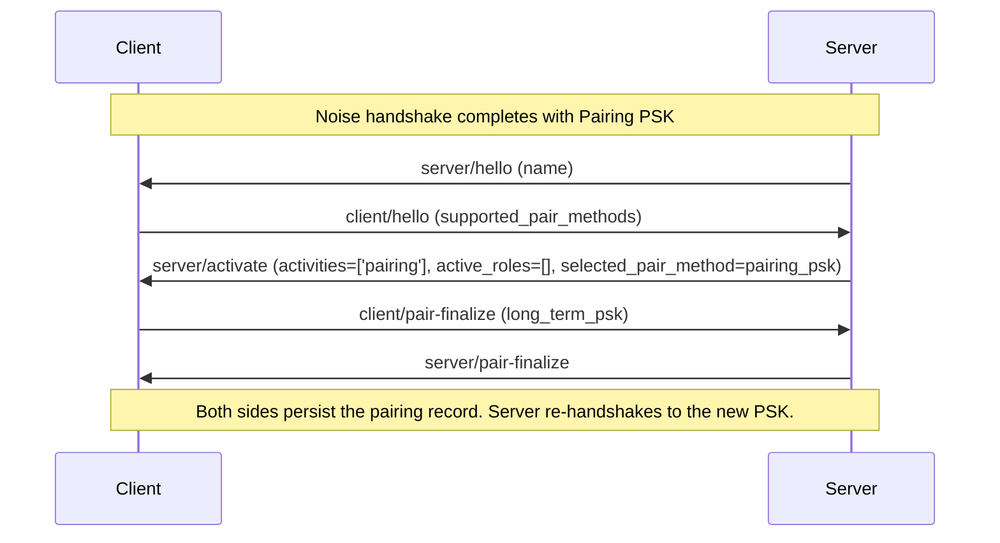

## Pairing

Pairing is the one-time setup that mutually authenticates a client and a server. The pairing flow uses the same WebSocket endpoint and [`KKpsk2`](connection.md#encryption) Noise pattern as every other connection; only the PSK fed into the handshake and the client's post-handshake routing differ (see [Pre-Shared Key](connection.md#pre-shared-key)). After any successful pairing both sides persist the new pairing record, then the server initiates an in-band [re-handshake](connection.md#re-handshake) to the newly delivered `long_term_psk`, bringing the channel to the new trust level without closing the WebSocket.

This specification defines three pairing methods. Servers must implement all three; clients must implement Pairing PSK and may additionally implement either or both PIN methods.

### Methods

1. **Pairing PSK** - pairing authenticated by a [Sendspin Pairing PSK](README.md#definitions); no PAKE round, no PIN. See [Pairing PSK Flow](#pairing-psk-flow).
2. **Dynamic PIN** - pairing with a per-session [Sendspin Pairing PIN](README.md#definitions) that the client derives from a commit-and-reveal binding to the Noise handshake and emits via an out-channel (display, speaker, etc.) for the operator to enter into the server. See [Dynamic PIN Pairing Flow](#dynamic-pin-pairing-flow).
3. **Static PIN** - pairing with a fixed [Sendspin Pairing PIN](README.md#definitions). Appropriate for devices with no out-channel; vulnerable to MITM if the PIN is disclosed. See [Static PIN Pairing Flow](#static-pin-pairing-flow).

- **Unpaired.** Sentinel PSK; the channel is unauthenticated until the CPace round completes. The round establishes trust from scratch and produces a new [long-term PSK](README.md#definitions).
- **Already paired.** The server moves the established connection into pairing (see [Entering and leaving pairing](#entering-and-leaving-pairing)) and runs the round over the existing long-term Sendspin PSK.

The client reveals the new PSK only after `server_kc` verifies, and only as `wrapped_psk` [sealed under the CPace output](#psk-wrapping): a peer that cannot complete the PAKE - wrong PIN, or a man in the middle relaying between two handshakes, whose differing `h` gives each leg a different `sid` - neither triggers the reveal nor can unwrap it.

Static pairing methods (Pairing PSK, static PIN) do not take over the device's out-channel. Dynamic pairing (dynamic PIN) takes over the out-channel - typically the audio output or display - to emit the per-session PIN, so it cannot run while audio is playing on the same device. A pairing attempt that arrives while another connection is playing is rejected (see [Multiple servers](connection.md#multiple-servers-server-initiated)); the operator must stop playback before initiating pairing.

Clients with a usable out-channel (display, speaker, etc.) SHOULD implement `dynamic_pin` rather than `static_pin`. `static_pin` is intended only for devices that genuinely cannot emit a per-session value.

The initial static PIN MUST be device-specific (e.g., randomly generated and printed on the device, or otherwise factory-provisioned) and MUST NOT be a fixed default shared across devices; a shared default would let anyone pair with any such device.

### Entering and leaving pairing

Pairing and playback are mutually exclusive on a connection. When a server moves an established connection into pairing it first quiesces the client's streams - sending [`stream/end`](messaging.md#server--client-streamend) for active stream roles and a [`server/state`](messaging.md#server--client-serverstate) with null role objects for state roles, as when a role is removed from `active_roles` - and then sends the pairing [`server/activate`](messaging.md#server--client-serveractivate) with empty `active_roles`. The quiesce is stream-only: unlike an [`available: false`](messaging.md#external-source-handling) transition, the client keeps its group membership and queued group state through the pairing activity - no move to a solo group, no previous-group memory, no bar on resuming in place.

Each pairing `server/activate` admits one **pairing attempt**, in progress from its first pairing message - [`client/pair-init`](#client--server-clientpair-init) (PIN methods) or [`client/pair-finalize`](#client--server-clientpair-finalize) (Pairing PSK) - until success or [`pair/abort`](#client--server-pairabort). The client bounds each attempt with an **attempt timeout** measured from its first message (recommended 2 minutes); on expiry it sends `pair/abort` with reason `attempt_timeout`.

The `server/activate` that ends the pairing transition declares the connection's resulting `activities` and reactivates roles via `active_roles`.

The same `server/activate` can also end a pairing attempt without finalizing: sent in place of [`server/pair-finalize`](#server--client-serverpair-finalize), it persists nothing and discards any received PSK. A client that, after sending [`client/pair-finalize`](#client--server-clientpair-finalize), receives `server/activate` likewise persists nothing.

After leaving pairing, a server silently discards pairing messages still in flight from the client - messages sent before the client observed the leave `server/activate`. A client that has aborted an attempt likewise silently discards pairing messages received before the next `server/activate`.

A server MAY send such a cancelling `server/activate` at any point during a pairing attempt. On receipt the client abandons the attempt, discarding all pairing state, and proceeds under the declared activities; an abandoned attempt is not an inner-authentication failure and does not touch the [lockout counter](#pin-pairing-lockout). Servers SHOULD apply their own timeout while waiting for [`client/pair-init`](#client--server-clientpair-init) in the static-PIN flow, cancelling the attempt as above on expiry.

### Unpaired Access

A client MAY admit a server with no pairing record to activate roles or declare the `'playback'` activity. The session's [trust level](README.md#definitions) is `'none'`, so [management](management.md#management) operations remain unavailable. Servers SHOULD consider their role-activation policy on such sessions in light of the MITM exposure described below. The default is the manufacturer's choice. The client's toggle is exposed at runtime via [`management/set-pairing-config`](management.md#server--client-managementset-pairing-config), and its current setting is advertised in [`client/hello`](messaging.md#client--server-clienthello) as `unpaired_access.enabled`. Servers must likewise allow their operator to enable or disable offering unpaired access. The offer is conveyed to the client through [`active_roles`](messaging.md#server--client-serveractivate), not a separate flag.

**Security.** Unpaired playback connections are vulnerable to **man-in-the-middle attacks**. The Sentinel PSK is a published constant, and in the unpaired case neither peer's static key is bound to its identity by any authenticated out-of-band exchange; an attacker on the local network may therefore impersonate either side. The Noise handshake still provides confidentiality and replay protection for the session itself, but offers no assurance about which peer it was established with.

### Pairing PSK Flow

The Noise handshake completes using the Pairing PSK, authenticating both sides. The client proceeds straight to [`client/pair-finalize`](#client--server-clientpair-finalize).

**Lifecycle.** The client generates its Pairing PSK from a CSPRNG and persists it across reboots. It is per-client and long-lived: a successful pairing does not consume or rotate it (pairing produces a separate long-term [Sendspin PSK](README.md#definitions)), so it can pair the client with any number of servers. The client MAY rotate it at any time, and a paired server can rotate it via [`management/set-pairing-config`](management.md#server--client-managementset-pairing-config) (`pairing_psk.psk`); rotation invalidates previously distributed copies but leaves established pairing records untouched.



If a connection is already open under any other PSK - Sentinel or a long-term [Sendspin PSK](README.md#definitions) - when the operator picks `pairing_psk`, the server first [re-handshakes](connection.md#re-handshake) to the Pairing PSK before sending the `server/activate` shown above.

Two standing client obligations follow from this flow:

1. The client MUST keep its Pairing PSK among its handshake PSK candidates whenever the method is [enabled](management.md#server--client-managementset-pairing-config), not only while a pairing activity is running: the server's re-handshake to the Pairing PSK succeeds only if the client already recognizes its `psk_id`.
2. Before sending [`client/pair-finalize`](#client--server-clientpair-finalize), the client MUST verify that the connection's matched PSK is the Pairing PSK (the receiving side of the `selected_pair_method` invariant in [`server/activate`](messaging.md#server--client-serveractivate)); on mismatch it aborts with [`pair/abort`](#client--server-pairabort) reason `method_not_supported`.

### Dynamic PIN Pairing Flow

Pairing with a per-session PIN derived from the Noise handshake and emitted by the client via its out-channel. The operator types it into the server, where a [PAKE](#pake) round authenticates both sides.

```mermaid
sequenceDiagram
    participant Client
    participant Server

    Note over Client,Server: Noise handshake completes (Sentinel PSK when unpaired; long-term Sendspin PSK when re-verifying a paired device)

    Server->>Client: server/hello (name)
    Client->>Server: client/hello (supported_pair_methods)
    Note over Server: Operator picks dynamic PIN
    Server->>Client: server/activate (activities=['pairing'], active_roles=[], selected_pair_method=dynamic_pin)
    Client->>Server: client/pair-init (commit_B)
    Server->>Client: server/pair-init (nonce_A)
    Note over Client: Derive PIN from (h, nonce_A, nonce_B), emit via out-channel
    Note over Server: Operator enters PIN
    Server->>Client: server/pair-auth (pake_msg_1)
    Client->>Server: client/pair-auth (pake_msg_2)
    Server->>Client: server/pair-confirm (server_kc)
    Note over Client: Verify server_kc
    Client->>Server: client/pair-confirm (client_kc, nonce_B)
    Note over Server: Verify commit opening, client_kc, and PIN binding
    Note over Client: Sent back-to-back, no server response awaited
    Client->>Server: client/pair-finalize (wrapped_psk)
    Server->>Client: server/pair-finalize
    Note over Client,Server: Both sides persist the pairing record. Server re-handshakes to the new PSK.
```

**Binding values.** The dynamic PIN flow introduces three values across two messages that bind the PIN to the underlying Noise handshake:

- `nonce_A` - 32 bytes drawn from a CSPRNG by the server, sent in [`server/pair-init`](#server--client-serverpair-init), base64url-encoded (43 chars).
- `nonce_B` - 32 bytes drawn from a CSPRNG by the client, kept private until [`client/pair-confirm`](#client--server-clientpair-confirm) reveals it (base64url-encoded, 43 chars).
- `commit_B` - `SHA-256("sendspin-pair-commit-v1" || nonce_B)`, sent by the client in [`client/pair-init`](#client--server-clientpair-init) before any value from the server is known (32 bytes base64url-encoded, 43 chars). Locks the client's contribution to the PIN derivation.

**PIN length.** The digit count `L` is determined per pairing session as the larger of the two sides' minimums: `L = max(client_min, server_min)`, clamped to 4–12, where `client_min` is `min_pin_length` from the client's [`dynamic_pin` descriptor](#client--server-clienthello-pair-method-descriptor) and `server_min` is the server's operator-configured minimum. The server computes it and sends it as `pin_length` in [`server/pair-init`](#server--client-serverpair-init). The client rejects a `pin_length` outside `[min_pin_length, 12]` with [`pair/abort`](#client--server-pairabort) reason `pin_length_unacceptable`.

**PIN derivation.** Once the client has received `nonce_A` and `pin_length`, both sides can derive the same PIN from the Noise handshake hash `h`, the two nonces, and the chosen length `L`:

```
digest  = SHA-256("sendspin-pin-derive-v1" || h || nonce_A || nonce_B)
PIN_int = uint256_be(digest) mod 10^L
PIN     = decimal(PIN_int) zero-padded to L digits
```

The hash input is the UTF-8 bytes of the literal label `"sendspin-pin-derive-v1"` (no separator, no NUL terminator) followed by `h` (32 bytes, raw), `nonce_A` (32 bytes, raw), and `nonce_B` (32 bytes, raw). The full 32-byte SHA-256 output is interpreted as an unsigned big-endian 256-bit integer; the PIN is its value modulo 10^L, zero-padded on the left to exactly `L` ASCII digits. The PIN bytes fed into CPace as `PRS` are these `L` ASCII digits - the same per-digit encoding as the static PIN.

**Client verification.** On receipt of [`server/pair-confirm`](#server--client-serverpair-confirm), the client verifies the CPace MCF tag `server_kc`. On failure the client sends [`pair/abort`](#client--server-pairabort) with reason `pin_mismatch`.

**Server verification.** When [`client/pair-confirm`](#client--server-clientpair-confirm) arrives, the server verifies, in this order:

1. `SHA-256("sendspin-pair-commit-v1" || nonce_B) == commit_B`
2. CPace MCF tag `client_kc`
3. `derived_PIN(h, nonce_A, nonce_B) == PIN_typed`

A revealed `nonce_B` that does not match `commit_B` is a [protocol error](#protocol-errors). A failed key confirmation or PIN binding check results in [`pair/abort`](#client--server-pairabort) with reason `pin_mismatch`. Any failure discards the received `wrapped_psk`. Only when all three checks pass does the server process [`client/pair-finalize`](#client--server-clientpair-finalize), [unwrapping](#psk-wrapping) the PSK.

**Device-presence verification.** When the server [leaves pairing](#entering-and-leaving-pairing) instead of finalizing, this flow doubles as a device-presence verification: the PIN is emitted through the device's own out-channel, so a successful round confirms the device on the connection is the one the operator is observing - useful on top of static pairing methods, which establish cryptographic identity but do not bind it to a specific physical device.

### Static PIN Pairing Flow

Pairing with a fixed PIN. The operator types it into the server, where a [PAKE](#pake) round authenticates both sides. Each attempt is gated by a [pairing window](#pairing-window) opened by an operator gesture on the client.

```mermaid
sequenceDiagram
    participant Client
    participant Server

    Note over Client,Server: Noise handshake completes (Sentinel PSK when unpaired; long-term Sendspin PSK when re-verifying a paired device)

    Server->>Client: server/hello (name)
    Client->>Server: client/hello (supported_pair_methods)
    Note over Server: Operator picks static PIN
    Server->>Client: server/activate (activities=['pairing'], active_roles=[], selected_pair_method=static_pin)
    Note over Client: Wait for operator to open pairing window
    Client->>Server: client/pair-init
    Note over Server: Operator enters static PIN
    Server->>Client: server/pair-auth (pake_msg_1)
    Client->>Server: client/pair-auth (pake_msg_2)
    Server->>Client: server/pair-confirm (server_kc)
    Note over Client: Verify server_kc
    Client->>Server: client/pair-confirm (client_kc)
    Note over Server: Verify client_kc
    Note over Client: Sent back-to-back, no server response awaited
    Client->>Server: client/pair-finalize (wrapped_psk)
    Server->>Client: server/pair-finalize
    Note over Client,Server: Both sides persist the pairing record. Server re-handshakes to the new PSK.
```

**Client verification.** On receipt of [`server/pair-confirm`](#server--client-serverpair-confirm), the client verifies the CPace MCF tag `server_kc`. On failure the client sends [`pair/abort`](#client--server-pairabort) with reason `pin_mismatch`.

**Server verification.** When [`client/pair-confirm`](#client--server-clientpair-confirm) arrives, the server verifies the CPace MCF tag `client_kc` before processing [`client/pair-finalize`](#client--server-clientpair-finalize). On failure the server sends [`pair/abort`](#client--server-pairabort) with reason `pin_mismatch` and discards the received `wrapped_psk`. On success it processes `client/pair-finalize`, [unwrapping](#psk-wrapping) the PSK.

#### Pairing window

Static PIN pairing gates each attempt on a **pairing window**: a state in which the client has decided to accept one pairing attempt. The window admits exactly one attempt and closes on completion, inner-authentication failure, [`pair/abort`](#client--server-pairabort), connection drop, operator cancellation, window-lifetime expiry, or attempt-timeout expiry.

- **Opening the window.** An operator gesture on the client opens the window: a physical button press, a reset-pinhole press, a button combo, a specific power-cycle pattern, a shake or motion gesture, or any equivalent implementation-defined action.
- **Window lifetime.** From window opening until [`client/pair-init`](#client--server-clientpair-init) is sent. Recommended 5 minutes. On expiry, the window closes silently. A subsequent attempt requires a fresh gesture.
- **Signal to the server.** The client sends [`client/pair-init`](#client--server-clientpair-init) once the window is open and the [`server/activate`](messaging.md#server--client-serveractivate) has arrived. The server must not send [`server/pair-auth`](#server--client-serverpair-auth) until it has received `client/pair-init`.

### PAKE

The PIN pairing flows use **CPACE-X25519-SHA512** as the PAKE construction, defined in [draft-irtf-cfrg-cpace-21](https://datatracker.ietf.org/doc/draft-irtf-cfrg-cpace/21/). The protocol runs in initiator-responder mode with explicit Mutual Confirmation Flow (MCF). The server takes role `A` (initiator); the client takes role `B` (responder).

Sendspin instantiates CPace's inputs as follows:

- `PRS` - the PIN as a UTF-8 byte string (the literal decimal digits - e.g., `0x31 0x32 0x33 0x34 0x35 0x36 0x37 0x38` for the PIN `"12345678"`).
- `sid` - the UTF-8 bytes `"sendspin-pair-pake-v1"` || `h` || `counter`. `h` is the Noise handshake hash (32 bytes, raw) available immediately after Noise transport mode begins; `counter` is the number of pairing [`server/activate`](messaging.md#server--client-serveractivate) messages sent since the last Noise handshake, encoded as a big-endian uint32 (4 bytes).
- `CI` - empty.
- `ADa` - the UTF-8 bytes `"server"`.
- `ADb` - the UTF-8 bytes `"client"`.

The four pairing message fields carry the corresponding CPace values, base64url-encoded without padding:

| Sendspin field | Carried in | CPace value | Bytes | base64url length |
|---|---|---|---|---|
| `pake_msg_1` | [`server/pair-auth`](#server--client-serverpair-auth) | `Ya` (server's public share) | 32 | 43 |
| `pake_msg_2` | [`client/pair-auth`](#client--server-clientpair-auth) | `Yb` (client's public share) | 32 | 43 |
| `server_kc` | [`server/pair-confirm`](#server--client-serverpair-confirm) | `Ta` (server's MCF tag, HMAC-SHA-512) | 64 | 86 |
| `client_kc` | [`client/pair-confirm`](#client--server-clientpair-confirm) | `Tb` (client's MCF tag, HMAC-SHA-512) | 64 | 86 |

### PSK Wrapping

In the PIN flows, [`client/pair-finalize`](#client--server-clientpair-finalize) does not carry the new PSK directly: the client seals it under a key derived from the CPace output, and sends the result as `wrapped_psk`. Both sides derive:

```
K_wrap = SHA-256("sendspin-pair-psk-wrap-v1" || sid || ISK)
```

The hash input is the UTF-8 bytes of the literal label (no separator, no NUL terminator) followed by `sid` (the CPace session id defined in [PAKE](#pake), raw) and `ISK` (the 64-byte CPace intermediate session key, raw). The client encrypts the 32-byte PSK with the AEAD of the connection's negotiated [cipher suite](connection.md#cipher-suites), key `K_wrap`, a 12-byte all-zero nonce, and empty associated data. `wrapped_psk` carries the 48-byte ciphertext-plus-tag, base64url-encoded without padding (64 chars).

To unwrap, the server decrypts `wrapped_psk` with the same AEAD, key `K_wrap`, and nonce, recovering the 32-byte PSK.

### Protocol Errors

A condition during pairing that no conformant peer produces - a malformed or missing field, a CPace share with the wrong length or encoding a low-order point, a revealed nonce that does not match its commitment, a `wrapped_psk` that fails to decrypt - is a **protocol error**: the detecting side closes the WebSocket without sending any application-level error message, and persists nothing.

### PIN-Pairing Lockout

PIN-pairing brute-force protection is built around a per-method failure counter that transitions to terminal lockout. For `static_pin`, the [pairing window](#pairing-window) additionally gates each attempt on a fresh operator gesture.

The following rules are mandatory for clients implementing `static_pin` or `dynamic_pin`:

- **Per-method failure counter.** The client maintains a failure counter for each PIN-pairing method family (`static_pin` and `dynamic_pin` tracked independently). The counter is persisted across reboots. It is not partitioned by `server_id` or source IP: a single per-method counter for the device.
- **Increment.** The counter for a method increments on each inner-authentication failure the client itself detects in that method's flow: its own verification of `server_kc` fails. No other event increments the counter.
- **Reset.** The counter for a method resets to zero when that method's inner authentication succeeds.
- **Terminal lockout.** When a method's counter reaches **10**, the method enters a **terminal lockout** state: the client refuses all pairing attempts for that method indefinitely. Exit requires a deliberate, local operator action (manufacturer-defined), or writing `locked_out: false` for the method via [`management/set-pairing-config`](management.md#server--client-managementset-pairing-config) from a paired server; on successful exit the counter resets to zero. A client MAY surface the lockout to the operator through a device-local mechanism (LED, on-screen indicator, audible cue), but SHOULD NOT use a persistent indicator for it, a transient cue suffices. If a server initiates a pairing-mode connection during terminal lockout, the client sends [`pair/abort`](#client--server-pairabort) with reason `locked_out`.

### Client → Server: `client/hello` pair-method descriptor

Each entry in `supported_pair_methods` in [`client/hello`](messaging.md#client--server-clienthello) is a descriptor object that names the pairing method and, for the PIN methods, advertises the kind of operator interaction the client expects so the server can render appropriate UX.

- `method`: 'dynamic_pin' | 'pairing_psk' | 'static_pin' - the pairing method identifier.
- `out_channels?`: ('display' | 'speaker' | 'other')[] - informational hint for `dynamic_pin` only, listing the channels through which the per-session PIN is conveyed to the operator.
- `min_pin_length?`: integer - the shortest PIN length in digits the client will accept for this method. Required on `dynamic_pin` descriptors, absent on others. Range 4–12 (RECOMMENDED initial value at least 6). The server combines it with its own minimum to choose the [PIN length](#dynamic-pin-pairing-flow).
- `locked_out?`: boolean - `true` when the method is in [terminal lockout](#pin-pairing-lockout), `false` when ready to accept a pairing attempt. Present on PIN-method descriptors only, absent for `pairing_psk`. Lets the server render appropriate UX ("device requires manual unlock") and decide whether to attempt this method at all.

### Messages

The pairing messages below are listed in the order they appear in the dynamic PIN flow (the most complete sequence). Static PIN pairing omits the [`server/pair-init`](#server--client-serverpair-init) message and the `commit_B` / `nonce_B` fields, but still uses [`client/pair-init`](#client--server-clientpair-init) as the pairing-window-opened signal; the Pairing PSK Flow additionally omits all `pair-init`, `pair-auth`, and `pair-confirm` messages.

**Sequence violations.** A pairing message that is out of sequence for the selected method and current state - and not covered by the silent-discard rules in [Entering and leaving pairing](#entering-and-leaving-pairing) - is a [protocol error](#protocol-errors).

#### Client → Server: `client/pair-init`

Starts the PIN-pairing [attempt](#entering-and-leaving-pairing). In static PIN, sent after the operator gesture opens the [pairing window](#pairing-window). In dynamic PIN, sent immediately after [`server/activate`](messaging.md#server--client-serveractivate). The server must not send [`server/pair-auth`](#server--client-serverpair-auth) (static PIN) or [`server/pair-init`](#server--client-serverpair-init) (dynamic PIN) before receiving this message.

A `pairing_index` lower than the server's own count is a leftover from a superseded pairing and is discarded silently; a higher value is a [protocol error](#protocol-errors). Only a match starts the attempt.

- `pairing_index`: integer - the number of pairing [`server/activate`](messaging.md#server--client-serveractivate) messages received since the last Noise handshake.
- `commit_B?`: string - `SHA-256("sendspin-pair-commit-v1" || nonce_B)` (32 bytes base64url-encoded, 43 chars). Required in [Dynamic PIN pairing](#dynamic-pin-pairing-flow); absent in [Static PIN pairing](#static-pin-pairing-flow). See [Dynamic PIN Pairing Flow](#dynamic-pin-pairing-flow)

#### Server → Client: `server/pair-init`

Server's nonce contribution in the [Dynamic PIN pairing](#dynamic-pin-pairing-flow) flow. Sent in response to [`client/pair-init`](#client--server-clientpair-init).

- `nonce_A`: string - 32 bytes from a CSPRNG, base64url-encoded (43 chars). See [Dynamic PIN Pairing Flow](#dynamic-pin-pairing-flow)
- `pin_length`: integer - the [PIN length](#dynamic-pin-pairing-flow) in digits: `max(client_min, server_min)` clamped to 4–12.

Upon receipt, the client validates `pin_length` against its own `min_pin_length` (see [PIN length](#dynamic-pin-pairing-flow)), then derives and emits the PIN; the operator then types it into the server.

#### Server → Client: `server/pair-auth`

Server's CPace public share. Sent once the server has both received [`client/pair-init`](#client--server-clientpair-init) (confirming the pairing window is open) and obtained the PIN from the operator. In static PIN the PIN is printed and available from the start; in dynamic PIN the client emits it after [`server/pair-init`](#server--client-serverpair-init).

- `pake_msg_1`: string - server's CPace public share `Ya` (32 bytes base64url-encoded, 43 chars). See [PAKE](#pake)

#### Client → Server: `client/pair-auth`

Client's CPace public share, sent in response to [`server/pair-auth`](#server--client-serverpair-auth).

- `pake_msg_2`: string - client's CPace public share `Yb` (32 bytes base64url-encoded, 43 chars). See [PAKE](#pake)

#### Server → Client: `server/pair-confirm`

Server's MCF tag, sent after the server has derived its CPace session key from `Yb`.

- `server_kc`: string - server's MCF tag `Ta` (64 bytes base64url-encoded, 86 chars). See [PAKE](#pake)

On receipt, the client verifies `server_kc` before sending [`client/pair-confirm`](#client--server-clientpair-confirm); see [Dynamic PIN Pairing Flow](#dynamic-pin-pairing-flow) / [Static PIN Pairing Flow](#static-pin-pairing-flow).

#### Client → Server: `client/pair-confirm`

Client's MCF tag, plus (in dynamic PIN pairing) the opening of the earlier commitment. In PIN pairing, the client sends [`client/pair-finalize`](#client--server-clientpair-finalize) immediately after this message without waiting for a server response.

- `client_kc`: string - client's MCF tag `Tb` (64 bytes base64url-encoded, 86 chars). See [PAKE](#pake)
- `nonce_B?`: string - the 32-byte preimage of `commit_B` sent earlier in [`client/pair-init`](#client--server-clientpair-init), base64url-encoded (43 chars). Present only in dynamic PIN pairing. See [Dynamic PIN Pairing Flow](#dynamic-pin-pairing-flow)

On receipt, the server verifies before processing [`client/pair-finalize`](#client--server-clientpair-finalize); see [Dynamic PIN Pairing Flow](#dynamic-pin-pairing-flow) / [Static PIN Pairing Flow](#static-pin-pairing-flow).

#### Client → Server: `client/pair-finalize`

Delivers the long-term PSK for this (client, server) pair. In flows that include a PAKE round, this message is sent immediately after [`client/pair-confirm`](#client--server-clientpair-confirm) without waiting for a server response, and carries the PSK [wrapped](#psk-wrapping) under the CPace output. In the [Pairing PSK Flow](#pairing-psk-flow), it starts the pairing [attempt](#entering-and-leaving-pairing) and is sent immediately after the [`server/activate`](messaging.md#server--client-serveractivate), carrying the PSK directly. Exactly one of the two fields is present.

- `long_term_psk?`: string - 43-character base64url-encoded 32-byte [Sendspin PSK](README.md#definitions) (no padding). [Pairing PSK Flow](#pairing-psk-flow) only
- `wrapped_psk?`: string - 64-character base64url-encoded 48-byte [PSK Wrapping](#psk-wrapping) of the new [Sendspin PSK](README.md#definitions) (no padding). PIN flows only

#### Server → Client: `server/pair-finalize`

Acknowledges that the server has persisted the pairing record. After receiving this message, the client persists its own record.

- payload: `{}`

#### Client ↔ Server: `pair/abort`

Aborts a pairing attempt, started or not. With reason `concurrent_attempt` the sender closes the connection after sending, otherwise the connection stays open. A `pair/abort` received after the receiver has itself ended the attempt has no effect.

- `reason`: string - one of:
  - `attempt_timeout` (client) - the pairing attempt did not complete within the [attempt timeout](#entering-and-leaving-pairing)
  - `concurrent_attempt` (client) - another pairing attempt is already in progress with this client
  - `locked_out` (client) - the client is in [terminal lockout#pin-pairing-lockout) for the selected pairing method
  - `method_not_supported` (client) - the server's activity set and `selected_pair_method` are not a permitted combination for the matched PSK, or `selected_pair_method` names a method the client does not currently offer
  - `pin_length_unacceptable` (client) - the `pin_length` in [`server/pair-init`](#server--client-serverpair-init) is below the client's `min_pin_length` or outside the 4–12 range
  - `pin_mismatch` (client or server) - PAKE key-confirmation failed, or (in dynamic PIN pairing) the PIN binding check failed
  - `user_cancelled` (client) - operator aborted the pairing through a local UI
