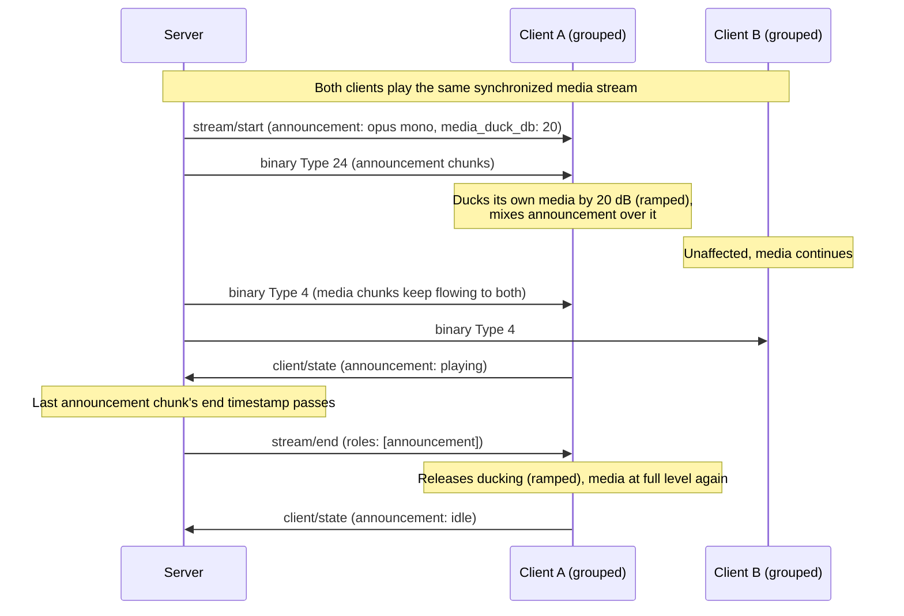

## Announcement messages
This section describes messages specific to clients with the `announcement` role: short, client-specific audio clips (voice-assistant responses, doorbell chimes, alerts) delivered as their own stream, independent of the `player` role's media stream. An announcement can play while media is playing (mixed over it, optionally ducking the media) or while nothing is playing at all. Media playback is never paused or interrupted by an announcement, so a grouped player's media timeline stays untouched while it plays one.

Announcements are addressed per client, and each targeted client ducks and mixes its own output. To announce on several speakers (a room, or everywhere), the server starts one announcement stream per targeted client - and since chunks carry absolute timestamps, it can schedule the same start time on all of them for a coordinated start. Which speakers to target is the user's/server's choice, not a protocol property; sample-accurate cross-client sync of announcement audio is out of scope.

The `announcement` role is optional for clients. It is typically advertised together with `player@v1`, but a client MAY advertise it standalone (e.g., a notification-only device).

**Note:** As with the player role, volume values (0-100) represent perceived loudness. Clients SHOULD convert volume to a linear amplitude as `amplitude = (volume / 100)^1.5`, applied over a short ramp.

### Client → Server: `client/hello` announcement@v1 support object

The `announcement@v1_support` object in [`client/hello`](../../messaging.md#client--server-clienthello) has this structure:

- `announcement@v1_support`: object
  - `supported_formats`: object[] - list of supported announcement audio formats in priority order (first is preferred)
    - `codec`: 'opus' | 'flac' | 'pcm' - codec identifier
    - `channels`: integer - supported number of channels (e.g., 1 = mono, 2 = stereo)
    - `sample_rate`: integer - sample rate in Hz (e.g., 48000)
    - `bit_depth`: integer - bit depth for this format (e.g., 16, 24)
  - `buffer_capacity`: integer - max size in bytes of compressed announcement audio in the buffer that is yet to be played

**Note:** Announcements decode on a second, concurrent pipeline next to the media stream, so clients SHOULD advertise inexpensive formats here (e.g., mono, 16-bit, modest sample rates). Both the format list and `buffer_capacity` are independent of the player role's. Servers must support all audio codecs: 'opus', 'flac', and 'pcm'.

### Client → Server: `client/state` announcement object

The `announcement` object in [`client/state`](../../messaging.md#client--server-clientstate) informs the server of announcement-specific state. Only for clients with the `announcement` role. All fields are optional and purely informational - the server derives announcement completion from the stream timeline regardless (see [Server behavior for announcements](#server-behavior-for-announcements)) - so a minimal client MAY never send this object.

- `announcement`: object
  - `state?`: 'playing' | 'idle' - whether announcement audio is currently being output. SHOULD be sent on transitions
  - `required_lead_time_ms?`: integer - minimum startup lead time in milliseconds for the announcement pipeline (codec init, decode warmup, mixer attach), measured like the player's [`required_lead_time_ms`](../player/v1.md#client--server-clientstate-player-object). When absent, the server SHOULD assume a conservative default (500 ms is recommended)

### Server → Client: `stream/start` announcement object

The `announcement` object in [`stream/start`](../../messaging.md#server--client-streamstart) has this structure:

- `announcement`: object
  - `codec`: string - codec to be used
  - `sample_rate`: integer - sample rate to be used
  - `channels`: integer - channels to be used
  - `bit_depth`: integer - bit depth to be used
  - `codec_header?`: string - codec header encoded as standard Base64, if necessary (e.g., FLAC)
  - `media_duck_db?`: integer - reduction in decibel (range 0-50, default 0) to apply to this client's own media output while the announcement stream is active. 0 means no ducking
  - `duck_ramp_ms?`: integer - ramp duration in milliseconds (range 0-2000, default 100) for both applying and releasing the ducking
  - `volume?`: integer - range 0-100. When present, the client SHOULD render the announcement at the loudness that master volume `volume` would produce, regardless of the current master volume (see [Mixing and Ducking](#mixing-and-ducking)). When absent, the announcement follows the current master volume

The format MUST be one the client listed in its [`supported_formats`](#client--server-clienthello-announcementv1-support-object).

Re-sending `stream/start` with an `announcement` object while an announcement stream is active updates the configuration without clearing buffers (e.g., to change the duck level mid-announcement); a new `media_duck_db` target ramps from the current gain. To replace the announcement audio itself, the server MUST first send [`stream/clear`](../../messaging.md#server--client-streamclear) listing the `announcement` role.

### Server → Client: `stream/clear` announcement

When [`stream/clear`](../../messaging.md#server--client-streamclear) explicitly lists the `announcement` role, clients drop all buffered announcement audio and continue with announcement chunks received after this message. The stream and the ducking state stay active. A `stream/clear` that omits the `roles` field is a media seek and does NOT affect the announcement stream.

### Server → Client: `stream/end` announcement

When [`stream/end`](../../messaging.md#server--client-streamend) lists the `announcement` role (or omits `roles`, which ends all active streams), the announcement stream is over: clients stop announcement output, discard any remaining buffered announcement audio, release the ducking (ramped over `duck_ramp_ms`), and report `state: 'idle'` if they report announcement state.

### Server → Client: Announcement Chunks (Binary)

Binary messages SHOULD be rejected if there is no active announcement stream or the client is not [`available`](../../messaging.md#client--server-clientstate).

- Byte 0: message type `24` (uint8)
- Bytes 1-8: timestamp (big-endian int64) - server clock time in microseconds when the first sample should be output
- Rest of bytes: encoded audio frame

Chunk timestamps within one announcement stream MUST be contiguous and monotonically increasing: each chunk starts where the previous one ended. Servers MUST NOT emit timestamp gaps; when announcement audio is produced slower than real time (e.g., streaming text-to-speech), the server pads with encoded silence, or rebases via [`stream/clear`](#server--client-streamclear-announcement).

Unlike media audio, announcement chunks are not sync-critical and MUST NOT be dropped for being late: the client SHOULD begin output at the first chunk's timestamp (translated via [clock synchronization](../../messaging.md#clock-synchronization)), or as soon as possible if that time has passed, and plays mid-stream chunks continuously in order. The [player sync accuracy rules](../player/v1.md#playback-synchronization) do not apply to announcement output.

## Announcement Playback Behavior

### Mixing and Ducking

A client with both an active media stream and an active announcement stream outputs both concurrently, mixed locally. The gain stages are ordered as follows:

1. `media_duck_db` applies to the media signal only, before mixing.
2. The announcement `volume` (when present) applies to the announcement signal only, before mixing. Since master volume is applied after the mix, the client compensates the announcement gain so the announcement is rendered at the loudness that master volume `volume` would produce. Implementations MAY snapshot the master volume at announcement start for this compensation.
3. The master volume and mute of the [player role](../player/v1.md#client--server-clientstate-player-object) apply to the mixed output. Announcements are therefore silenced on a muted client.

Starting an announcement stream MUST NOT pause, stop, mute, or shift the timeline of the client's media stream - ducking is a gain change only. This keeps a grouped client's media playback sample-identical with its group while it plays an announcement.

Clients that cannot apply a fractional gain reduction MAY implement any non-zero `media_duck_db` as full attenuation of the media signal (duck to silence). Ducking is a no-op while no media is playing locally, and the role works without a `player` role active.

### Announcement Lifecycle

- At most one announcement stream is active per client at a time.
- Ducking is bound to the local announcement stream lifetime: it is released (ramped) when the stream ends, is aborted, or the transport drops - a broken connection never leaves media ducked.
- Announcement streams are ephemeral: after transport loss they MUST NOT be resumed or replayed. There is no late-join or catch-up for announcement audio.
- If an active announcement stream stalls (buffer drained and no data arriving), the client MAY locally end it after a timeout (5 seconds is recommended), releasing the ducking and reporting `state: 'idle'`.

### Interaction with Media, Groups, and Other Roles

- Announcement streams are independent of group membership and of the media stream lifecycle: group changes, media `stream/start`, media-scoped `stream/clear`, and media `stream/end` do not affect an active announcement stream (ducking simply becomes a no-op when media ends). [`group/update`](../../messaging.md#server--client-groupupdate) describes the media group only.
- Announcement audio MUST NOT be reflected in visualizer or color output, and does not alter metadata or artwork state - those roles describe the media stream only.
- There is no `stream/request-format` for the announcement role: the server picks a fresh format from the client's `supported_formats` for every announcement.

### Server behavior for announcements

- The server MUST NOT send any announcement-scoped message (`stream/start` with an `announcement` object, `stream/clear`/`stream/end` listing `announcement`, or type `24` binary) to a client whose `active_roles` do not include the announcement role.
- The chunk duration bounds of the player role apply (15-150 ms; see [Server Audio Send Constraints](../player/v1.md#server-audio-send-constraints)).
- The first chunk's timestamp SHOULD be at least the client's announcement `required_lead_time_ms` (or the 500 ms default) past the `stream/start` server transmit time.
- `buffer_capacity` is a hard per-client byte limit on outstanding un-played compressed announcement audio.
- The server knows when the announcement has finished playing from its own timeline (the last chunk's end timestamp). For normal completion it SHOULD NOT send `stream/end` for the announcement role before that time has passed; sending it earlier is the abort path.
- Announcements ride the client's admitted connection: the server allowed to stream media may announce. Letting a *second* server (e.g. a voice assistant) announce while another server streams media requires announcement-capable secondary connections in the [connection admission model](../../connection.md#multiple-servers-server-initiated) - a companion change tracked separately from this role.
- There is no negative acknowledgement; a client MAY silently ignore an announcement stream it cannot currently service.

### Example: announcement during grouped playback

